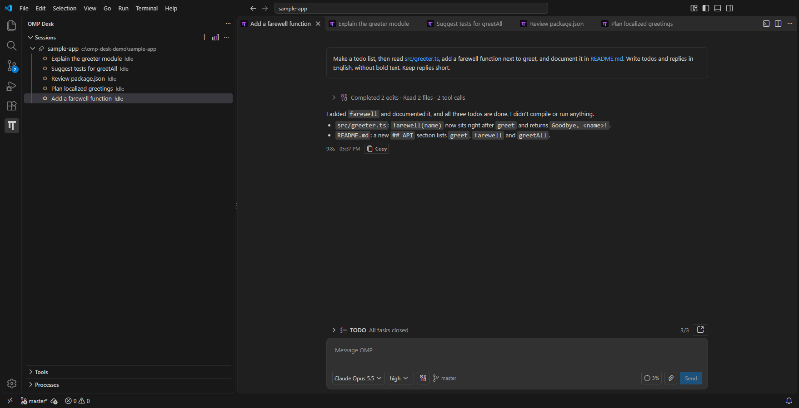
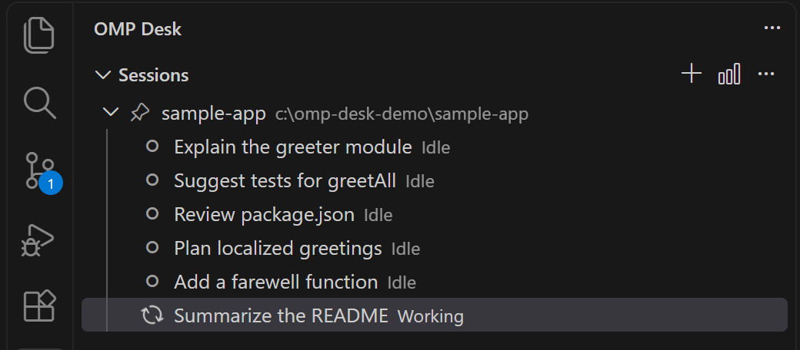
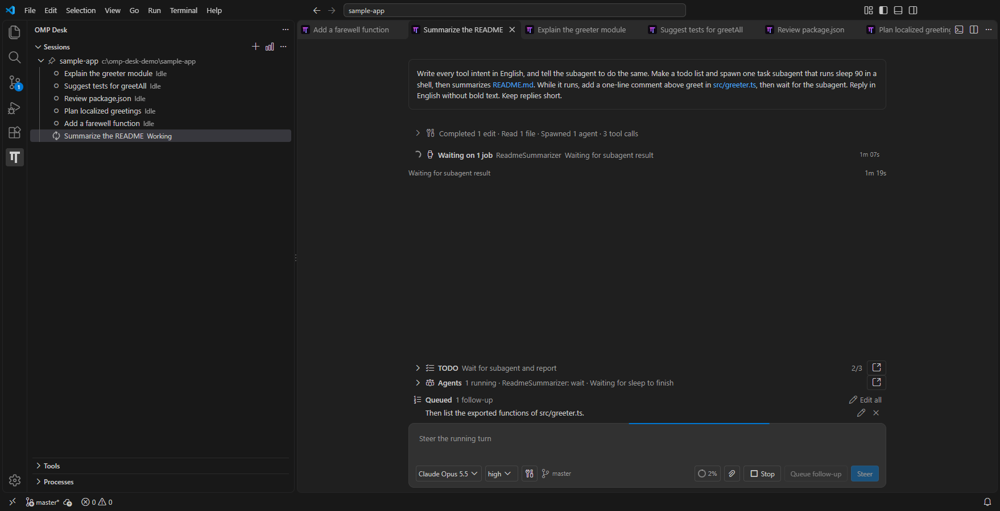
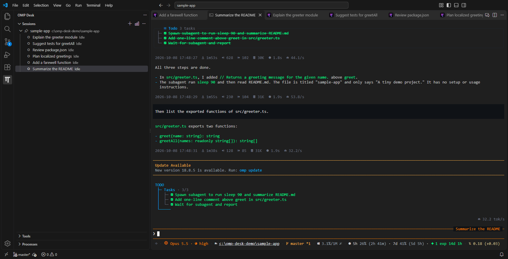

# OMP Desk

Run your [Oh My Pi](https://github.com/can1357/oh-my-pi) (`omp`) sessions from VS Code. OMP Desk lists every folder and conversation in one **Sessions** view. Each session opens in an editor tab as a rich **Chat** or as OMP's own native **Terminal** UI. Sessions keep running when you close the tab or reload the window.

> **Preview.** OMP Desk is an unofficial, independent integration, not an official OMP distribution. It is Windows-only.

## Requirements

- Windows 10 or 11, x64 or arm64.
- VS Code 1.110 or newer, in a trusted workspace.
- [Oh My Pi](https://github.com/can1357/oh-my-pi) installed, on your `PATH` and logged in to a provider. OMP Desk never bundles, installs or updates OMP; it runs the `omp` you already have.

## Getting started

1. Install **OMP Desk** (`hmmvot.omp-desk`) from the Extensions view. Or download the VSIX for your architecture from [releases](https://github.com/hmmvot/omp-desk/releases) and run `code --install-extension omp-desk-win32-x64-0.1.0.vsix` (or `omp-desk-win32-arm64-0.1.0.vsix`).
2. Open the **OMP Desk** view in the Activity Bar. The folders open in this window are already listed, with their existing OMP sessions.
3. Use a folder's **New Session** action. The session opens in an editor tab.
4. Close the tab whenever you like. The session keeps running until you stop it.

## Features

### Sessions that survive restarts

- Each session runs in its own background process.
- Close its tab, reload the window or close VS Code: the session keeps working.
- Reopen it to get the same process and screen back.
- Only one window writes a session at a time.
- Stopping a session never deletes its history.

For how this works, see the [architecture](docs/architecture.md).

### Desktop notifications

- A Windows notification tells you when a session finishes or asks for input.
- None appears for the session you are already looking at.
- Click the notification to jump to the session.
- Turn them off with `omp.desktopNotifications`.

### Chat or Terminal in one tab

- **Switch to Chat** and **Switch to Terminal** in the editor title change the view of the same session.
- New sessions open in Chat. Choose Terminal for all new sessions with **OMP: Choose Default Session View…**.
- Prefer the OMP terminal? Use OMP Desk as a host for native OMP terminals that survive reloads.
- Sessions open in their own editor group on the left, and OMP Desk locks it. Files opened from Chat links, the Explorer or Quick Open go to a group on the right, so you read them next to the chat. Turn this off with `omp.chatColumn`; unlock the group from its title bar for a one-off change.

### Sessions view

- Shows every OMP session, running or stopped, of the folders open in this window and the folders you pin. By default it is **one flat list**, each row labelled `folder · title`; the button in the view's title bar switches to sessions **grouped under their folders** and back (`omp.sessionsGrouping`).
- The flat list puts sessions that are not stopped first, unread ones on top and then the most recently active, and stopped sessions last. A **New Session…** row at the end asks for the folder.
- A blue **●** at the right end of a row marks a reply you have not read: the agent finished or asked you something while you were not looking at that session. It clears when you look at the session's editor, and it survives a window reload.
- While a session has an open editor, its row stays selected: the one you viewed most recently. Selecting a folder or the New Session row puts the selection back.
- If the default OMP profile has no models yet, **Log in to a model provider to start** appears above the sessions.
- **Pin Folder** keeps a folder in every window. **Add Folder** picks and pins another one.
- Live status per session: **Working**, **Waiting for subagents**, **Needs your answer**, **Idle** or **Unread reply**.
- A session open in another window says so. **Switch to Window** takes you there.
- A session that a plain `omp` in a terminal is writing shows **Open in another OMP process**. OMP Desk asks before opening it too.
- Row actions: **Open**, **Rename**, **Reload**, **Close**, **Forget** and **Delete**. A folder's **Resume Session** lists every saved session.
- **Open Terminal in Folder** starts a plain shell editor in that folder.
- **Copy Diagnostics** in the context menu copies paths and process details for bug reports.

### Chat

- Streaming replies, saved history, image attachments and `@file` mentions.
- While a turn runs, `Enter` steers it and `Alt+Enter` queues a follow-up. Queued messages can be edited, removed or sent now as steering. `Alt+↑` takes the newest one back into the draft.
- **Stop** (or `Esc`) puts messages that were still queued back into the draft instead of running them.
- `↑`/`↓` in an empty composer walk through your earlier prompts. `Ctrl+R` searches past prompts of every conversation.
- **Retry** (`F5` or `Alt+R`) re-runs a failed or aborted reply.
- Copy buttons on code blocks and on your own messages.
- `Ctrl+T` shows or hides all thinking, and `Ctrl+O` expands or collapses all tool calls. Every Chat remembers both choices.
- **Compact…** and **Shake…** in the context popover ask for OMP's mode first (`snapcompact` and `elide` preselected); **Export as HTML** and **Share** are in the editor title menu. `Alt+click` the model or thinking chip to cycle it; `Ctrl+Shift+U` cycles thinking.
- Terminal-only slash commands such as `/hotkeys` or `/settings` are never sent to the model. Chat opens the VS Code equivalent or says where the command works.
- Status lines and warnings from OMP extensions appear around the composer; their informational notices are not shown.
- **Rewind** goes back to one of your prompts in place and puts it into the composer to edit and send again: `Esc` `Esc` in an empty composer, **Rewind to here** on a prompt, `/rewind` or `/branch`, or **OMP: Rewind Conversation…**. **Undo** returns to where you were, and a marker where the conversation split switches between your branches.
- Rewind never restores files; it lists the files changed after that point. A chat started by an older OMP Desk must be restarted before it can rewind.
- Slash commands suggest their arguments.
- OMP's questions and approval requests appear as a card above the composer.
- File paths in replies and tool rows are links. A click opens the file at that line. Code symbols in a reply (`Ability`, `AbilityData.Cast()`, `Parse<T>`, `[AllowedOn]`) are links too when VS Code's language extensions (C# Dev Kit, TypeScript, and others) report exactly one definition of them in the session's folders: a click opens the definition, `Ctrl+Click` shows its file in the Explorer. A symbol with several definitions links to VS Code's symbol search for its name (dotted underline, tooltip "N definitions"): a click lets you choose. A symbol none is found for stays plain code. The language extension must have loaded the workspace (a TypeScript server starts when a TypeScript file is open); symbol searches are ranked and may be capped by the language server, so in a very large workspace a common name may be missed or, rarely, linked to one of several declarations.
- Web links in replies, tool output and the TODO and Agents tabs open in a VS Code editor tab on click or `Enter`, and in your browser on `Ctrl+Click` or `Ctrl+Enter`.
- Routine tool calls are grouped in an **Overview**. The **Tools output** chip switches every Chat to **Detailed**.
- Pinned rows show the TODO list and running subagents. Open a subagent's live transcript in its own tab.
- Model and thinking pickers. The footer shows context usage, provider quotas and the Git branch.
- Without available models, the model chip offers **Log In to Provider**. Every model picker also ends with **Log In to Provider…** to add another provider.
- Your draft stays until OMP confirms it. Nothing is resent automatically.
- If OMP stops responding, **Reconnect** or **Restart** the conversation.
- Follows your light, dark or high-contrast theme.

### Terminal

- The unmodified native OMP TUI, with Nerd Font glyphs, links and clickable file paths.
- Web links drawn by OMP open the same way as in Chat.
- **Copy screen** and **Redraw Terminal** (`Ctrl+Alt+Shift+R`) in the editor title menu.
- Theme changes recolor the terminal without restarting it.

### Send code to a session

- Select code and press `Alt+Shift+K`, or use **Add Selection to Session** or **Add File to Session** from the editor, Explorer or tab context menu.
- Pick the session. OMP Desk inserts an `@path` reference, with lines for a selection.
- It never sends the prompt for you.

### Processes, Stats and Tools

- **Processes** lists the background processes behind your sessions and folder terminals. **Stop** ends one; **Stop Orphaned and Idle Processes** cleans up unused ones.
- **Stats** in the Sessions title opens OMP's usage dashboard in an editor tab. If your OMP build would also open a browser, OMP Desk asks first.
- **Tools** lists the tools of the session in the active OMP editor, and its skills in Chat.

## Commands and shortcuts

All commands are in the Command Palette under **OMP**. The ones with default keys:

| Key | Command | When |
| --- | --- | --- |
| `Ctrl+Shift+Q` | Focus the chat composer of the active or visible session; opens the OMP Desk side bar when no session is open | Anywhere, including the integrated terminal |
| `Ctrl+Alt+Q` | Go to Session: a searchable list of every session (title, folder, status; unread first, stopped last, as in Sessions) that opens the one you pick, with **New Session…** at the end | Anywhere, including the integrated terminal |
| `Ctrl+Shift+M` | Toggle the file window: the first press moves all files of the group next to the chat into one window that stays on top (files from Chat links open there too); the next press brings them back next to the chat and closes it | Anywhere, including the integrated terminal (replaces VS Code's Problems key; a keymap extension that binds it in text editors wins there unless you add a user keybinding) |
| `Ctrl+Enter` | Send composer prompt (`Enter` in the composer also sends) | Chat editor focused |
| `Esc` | Stop current turn | Chat editor, turn running |
| `Ctrl+Shift+L` | Focus chat composer | Chat editor |
| `F5`, `Alt+R` | Retry the failed or aborted reply | Chat editor, no turn running |
| `Ctrl+R` | Search prompt history | Chat editor |
| `Ctrl+T` / `Ctrl+O` | Show/hide all thinking / expand/collapse all tool calls | Chat editor |
| `Ctrl+Shift+U` | Cycle thinking level (**Cycle Model** has no default key) | Chat editor |
| `Ctrl+Alt+Shift+R` | Redraw Terminal | Terminal editor |
| `Alt+Shift+K` | Add Selection to Session | Text editor with a selection |

Other commands include **New Session**, **Add Folder**, **Pin Folder**, **Unpin Folder**, **Resume Session**, **Switch to Chat / Terminal**, **Compact Conversation…**, **Shake Conversation…**, **Export Conversation as HTML…**, **Share Conversation Link…**, **Show Chat Keyboard Shortcuts**, **Open Stats**, **Log In to Provider…**, **Show Diagnostics** and the file-change observation commands.

## Settings

| Setting | Default | Meaning |
| --- | --- | --- |
| `omp.toolCallDetail` | `overview` | `overview` groups routine tool calls; `detailed` shows each call. Applies to every Chat. |
| `omp.desktopNotifications` | `true` | Windows desktop notifications when a session finishes or asks for input. |
| `omp.showWorkspaceFolders` | `true` | Show the folders VS Code has open in this window in Sessions. When off, only pinned folders (and folders with a running session) are listed. |
| `omp.useAgentRootFolder` | `true` | When a folder VS Code has open has no agent files (`AGENTS.md`, `CLAUDE.md`, `.agents`, `.omp`, `.claude`, `.pi`) but sits inside a Git repository whose root has them, Sessions shows that ancestor instead, so new sessions start where OMP finds the repository's agent files. Sessions recorded in the opened folder stay listed under it. |
| `omp.sessionsGrouping` | `flat` | `flat` shows one list of every session, labelled with its folder; `folders` groups sessions under their folders. The Sessions title-bar button changes it. |
| `omp.linkCodeSymbols` | `true` | Link inline code symbols in Chat replies (`Ability`, `AbilityData.Cast()`, `[AllowedOn]`) to their definition when VS Code's language extensions report exactly one definition of the symbol in the session's folders. A partial class or overloads link to one of their declarations; a symbol with several different definitions links to the symbol search; unknown symbols stay plain code. |
| `omp.chatColumn` | `true` | Open sessions in their own locked editor group on the left, with files on the right. When off, a session opens in the active editor group. |

OMP's own settings, models, tools, skills and MCP servers live in OMP's files. Configure them through OMP.

## Limitations

- Windows only. There are no macOS or Linux builds.
- Stopping a folder shell cannot guarantee that every child process stopped. Commands detached from the shell may keep running.
- OAuth-dependent MCP setup, and anything OMP asks you to do in its own settings UI, is done in OMP.
- Installing OMP and switching OMP versions are outside the extension.

## Privacy and security

Everything runs on your machine. OMP Desk talks to your local `omp` over authenticated local pipes, keeps its metadata in VS Code's global storage and sends no telemetry. Notification text contains the session title, the folder name and a short reason or question; Windows may keep it in notification history. Please report vulnerabilities privately; see [SECURITY.md](SECURITY.md).

## Troubleshooting

- **OMP not found.** Make sure `omp --version` works in a new terminal, then reload the window.
- **Something looks wrong.** Open **View > Output** and choose **OMP Desk**, and run **OMP: Show Diagnostics**. Include both when you [report a bug](https://github.com/hmmvot/omp-desk/issues/new/choose).
- **Upgrading from an early local build.** See [Moving from the unpublished local build](docs/publishing.md#moving-from-the-unpublished-local-build).

## Documentation and contributing

Design documents, architecture decision records and the current architecture are in [docs](docs/README.md). Contributions are welcome: see [CONTRIBUTING.md](CONTRIBUTING.md), and [CHANGELOG.md](CHANGELOG.md) for what changed.

## How this was made

OMP Desk is 100% vibe coded. All of its code, tests and documentation were written by AI agents running in [Oh My Pi](https://github.com/can1357/oh-my-pi); none of it was written by hand. Agents also reviewed the designs and code, and ran the automated tests. Expect rough edges, and please [report them](https://github.com/hmmvot/omp-desk/issues/new/choose).

## License and credits

OMP Desk is released under the [MIT License](LICENSE). It uses and adapts open-source work, listed with its licenses in [THIRD_PARTY_NOTICES.txt](THIRD_PARTY_NOTICES.txt): [oh-my-pi](https://github.com/can1357/oh-my-pi) (MIT, including the adapted icon artwork), [Paseo](https://github.com/getpaseo/paseo) (Apache-2.0, text reveal policy), [xterm.js](https://github.com/xtermjs/xterm.js) and [node-pty](https://github.com/microsoft/node-pty) (MIT), React (MIT) and the VS Code [Codicons](https://github.com/microsoft/vscode-codicons) (CC-BY-4.0).
