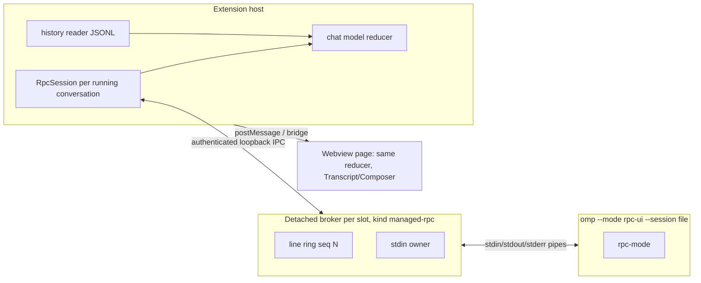

# Move chat and Sessions from Collab to `omp --mode rpc-ui` under the detached broker

> Ownership policy amended by [ADR-0039](../decisions/0039-refuse-only-on-a-verified-live-writer-the-extension-owns.md), implemented in source with fixture acceptance, not yet installed-window acceptance: only positive owned writers exclude actions; stale/release states and uncertainty refusals are removed. Sections 4–5 below describe the cutover.

> Chat surfaces narrowed by the implemented [compact-footer design](2026-10-01-compact-chat-footer.md): notices, header, settings/configuration/tool inventory and usage panels and their exclusive plumbing are removed. Model/thinking move to lazy host-readback footer pickers; context remains. Native provider login is command-only. Pipe protocol 3 retains binding/evidence and the independent names-only clipboard command, not configuration. The original rollout and observations below remain historical evidence at their stated baseline.

## Problem

The extension's chat editor is a Collab guest. Each conversation needs a relay sidecar, a Collab room, a bearer link
obtained by out-of-process `omp collab list|link` calls, an AES-GCM sealed socket in the page, and a raw-receive
recorder that exists only to inspect that socket. Measured and reported consequences:

- a restored tab sits on "waiting for the local link" until the room is published, and a second tab opens slowly because
  launch blocks on `waitForCollabHostOfProcess` (45 s deadline, 400 ms→2 s backoff, `native-terminal.ts:958-985`) followed
  by `omp collab link` (`native-terminal.ts:1008-1169`), each an `omp` process spawn with a 20 s timeout;
- ownership and absence evidence is expressed in Collab terms: a row is proved gone only when its *room* is withdrawn
  and its process is gone (`session-index.ts` `absenceEvidenceForRecordedHost`), so a roomless launch is held forever
  and three accepted ADRs (0035, 0036, 0037) exist mostly to route around missing room evidence;
- about 15.6k lines (raw recorder, relay, guest wire stack, link/room plumbing) exist only for this transport.

The user has decided (2026-09-29) to make OMP's own `--mode rpc-ui` the chat transport and to remove Collab completely,
with no fallback. An ACP-based transport was evaluated and rejected because ACP forces `enableMCP:false`
(`main.ts:512-557` of installed OMP), which would disable native MCP discovery.

## Goals and Non-goals

Goals — the MVP has exactly three surfaces:

1. **Sessions panel**: folders and sessions, open/resume, running/stopped state that comes from broker child identity,
   no flicker on refresh, and the active editor tab's row stays selected when the user switches editor tabs.
2. **Basic chat in the editor Webview**: history, prompt, streaming assistant text/thinking/tool calls/results, abort,
   steer/follow-up while streaming, tool-approval and extension dialogs answered from the Webview, model and thinking
   selection through rpc commands.
3. **Restore**: running sessions and chat tabs bound to sessions survive (a) an extension-host-only restart (the surviving
   page rebinds through the existing authenticated bridge and the OMP process keeps running) and (b) a full VS Code
   restart (VS Code restores the editor through the serializer; a still-running process is re-adopted, otherwise the
   session is reopened with `--session <exact file>`). Target: each restored tab shows its history within about 3 s;
   no 45 s Collab polls, no "waiting for local link".

Non-goals:

- **MCP servers that need an interactive OAuth consent** (`MCPManager.setAuthHandler` is wired only by interactive
  mode, and rpc has no `open_url` route for MCP 401/403). This is planned for a *future companion OMP extension*; this
  design neither builds it nor leaves a hook for it. Native MCP discovery that needs no fresh consent keeps working as
  OMP provides it (deferred and asynchronous in rpc-ui, `sdk.ts:2375`, so tools arrive late — accepted, no UI signal).
- Collab, the relay, the raw Collab recorder, the Agents Hub and the Chat|native-TUI switch: removed, no fallback.
- No OMP source patch. No ACP. No session switching inside a process (`new_session`, `switch_session`, `open_session`,
  `branch`, `handoff` are not offered; one process serves one conversation).
- No subagent progress UI, host tools (`set_host_tools`) or host URI schemes in the MVP.

## Current State

Evidence for the rpc-ui protocol is the protocol report and live probes taken while writing this design; source
pointers below are into this repository as it stood before the cutover (the last Collab-era state plus the working tree).

- **Launch.** `launchNativeOmpHostUnderBroker` (`src/host/native-terminal.ts:3003`) runs the resolved installed OMP
  *directly* under a detached, authenticated PTY broker (`spawnPtyBroker`, `pty-runtime.ts:412`; slot record
  `pty-registry.ts`; HMAC loopback IPC `pty-ipc.ts`; identity `pty-identity.ts`). The broker knows two kinds,
  `managed-omp` and `folder-shell` (`isPtyKind`, `pty-protocol.ts:240`), and its child is always a node-pty pseudo console.
  ConPTY cannot carry JSONL (it merges stderr, translates CRLF, echoes).
- **Chat transport.** Collab: `src/relay/*`, `views/session-link.ts`, `host/collab-room-identity.ts`, the guest stack
  `webview/lib/{client,socket,link,codec,use-guest}.ts`; readiness is the room appearing. The page's model is
  `GuestSnapshot` (`webview/lib/client.ts:53-110`): `entries: SessionEntry[]`, a streaming assistant ghost, `activeTools`,
  `working`, `uiRequest`, `todo`, `plan`, `notices`. `Transcript`, `ToolCard`, `Markdown`, `Composer`, `transcript-window.ts`
  and `todo-plan.ts` render/derive from it and touch neither relay nor crypto.
- **Sessions.** `views/session-tree.ts` is a read-only projection over `SessionLauncherFacts` (`extension.ts` `launcherFacts`
  :7772); durable rows live in the profile catalog (`profile-catalog.ts`); discovery reads JSONL headers directly
  (`session-index.ts` `readSessionFileHeader`, `folder-history.ts`, `native-history-roots.ts`). Ownership is reconciled by
  `createOwnerReconciler` (`native-terminal.ts:1842`) from `listHosts` (= `omp collab list`), terminal-by-pid, a read-only
  broker-slot probe and pid occupation. The single-writer guard `session-claim.ts` has no Collab dependency.
- **Restore.** VS Code serializers per editor view type (`registerBridgeSerializer` `extension.ts:4959`); identity-only page
  state `{version:2, tabId, editorId}`; surviving pages reconnect over the per-editor loopback bridge
  (`bridge-listener.ts`, `bridge-route.ts`, `bridge-endpoint.ts`, `bridge-records.ts`, wire `bridge-protocol.ts`).
- **Host control.** `omp -e <staged out/omp-host-control.mjs>` with bun `--preload/--define` loads a per-process authenticated
  named-pipe server *inside* the OMP process (`src/omp/host-control.ts`, `control-client.ts`, `control-protocol.ts`): config
  layer snapshot, model list, tool names, `setModel`/`setThinking` with a request-id ledger, and the `tool_call` hooks of the file
  observer (`src/omp/file-evidence.ts`).
- **Observed rpc-ui facts used below** (installed OMP 18.4.3): stdout is JSONL; `ready` frame first
  (`{protocolVersion:1, supportedProtocolVersions:[1,2], maxFrameBytes:1048576, maxReassembledFrameBytes:67108864}`);
  `negotiate_protocol {protocolVersion:2}` switches the encoder to base64 `rpc_chunk` frames for >1 MiB logical frames; a
  chunk train is contiguous (the decoder throws if another frame interleaves, `rpc-frame.ts` `RpcFrameDecoder`); responses echo the
  command `id` and are *not* guaranteed to start with `"type"` (`{"id":…,"type":"response",…}`); events carry only a
  process-local `messageId`; `message_end` persistence is queued so `get_entries` can lag live events; there is no
  `entry_appended` frame; `get_entries {since}` fails `unknown_since` for an unknown cursor; stdin EOF disposes the session
  (aborting a running turn) and exits in about 0.5 s; there are no signal handlers and no reattach; two processes can write
  one file (advisory per-append locks only); opening an existing session and exiting **appends** a `custom/session_exit`
  entry; `switch_session` to a different header cwd returns `{cancelled:true}`.
- **Probes made while writing this design** (OMP 18.4.3, scratch cwd): `get_state.sessionFile` and `sessionId` were
  returned immediately after `ready` for a *new* session and the file did **not** exist on disk (created lazily);
  `get_entries` on the new session already returned in-memory `model_change`/`thinking_level_change` rows; `ready` arrived
  after 30.5 s in one cold probe on a loaded machine (stderr: `Still starting after 28s — phase: createAgentSession >
  discoverSkills`) versus 1.7–2.0 s in the earlier protocol probes; `get_state` keys include `model`, `thinkingLevel`,
  `isStreaming`, `isSettled`, `sessionFile`, `sessionId`, `messageCount`, `dumpTools`, `contextUsage`. A real session file
  begins with a `title` line, then the `session` header (`version:3`, `cwd`), then id/parentId-linked entries (including
  persisted `custom` `tool_execution_start` rows).
- **Slash builtins in rpc.** `new`, `resume` and `fork` have no text-mode handler (`builtin-lifecycle.ts:188,401`,
  `builtin-session.ts:552`), so typed as a prompt they would be sent to the model verbatim; `handoff` and `move`
  *do* have handlers and change session identity or cwd inside the process (`builtin-lifecycle.ts:334,722`).

## Proposed Design

Written as the proposal; it is now implemented (see the acceptance record below). Where implementation refined a rule, the
section states the implemented behavior; [architecture](../architecture.md) remains the authority for the current system.

### 0. Shape



Three decisions shape the rest:

1. **One `omp --mode rpc-ui` process per conversation, owned by the existing detached broker** through a new pipe-child
   kind, so it survives extension-host and VS Code restarts exactly as managed hosts do today.
2. **The extension host owns the conversation runtime (`RpcSession`); a Webview is only a view.** A conversation with a
   running process is attached by the host even when no editor is open. Activity, turn-complete notifications, pending
   approvals and Sessions row state therefore come from frames the host itself reads, not from guest reports.
3. **History is painted from the JSONL file first and reconciled with rpc.** The host reads the session file directly (the
   only possible source for a stopped session, and the fastest one for a running session), then asks the process only for
   what happened after that point.

### 1. Process hosting

**Broker kind.** `PtyKind` becomes `"managed-rpc" | "managed-omp" | "folder-shell"`. `managed-omp` stays parseable so records of Collab-era slots can still be probed (section 5) but is **never launched again**. `isPtyKind` (`pty-protocol.ts:240`) and the broker's kind check (`pty-broker.ts:255-256`) accept the new kind.

**`PTY_PROTOCOL_VERSION` (2) and `PTY_RUNTIME_VERSION` are not bumped.** A client attach refuses any record whose `protocolVersion` differs from its own, and the version is bound into the handshake MAC (`pty-client.ts:638-645`, `pty-protocol.ts:496,504`, `pty-ipc.ts:581`); a bump would make every surviving Collab-era `managed-omp` broker and every running folder shell of the previous build unreachable, breaking legacy Stop (section 5), the broker witnesses and shell reconnect. The `rpc-*` frames below are therefore **additive frame types gated by the record's `kind`**: a client sends them only to a `managed-rpc` record, so a previous-build broker never receives one, and the new broker keeps speaking every existing v2 frame for `managed-omp` and `folder-shell`. Acceptance includes a test that a previous-build broker of both kinds is still probed and stopped after the upgrade.

**Pipe child.** A new module `src/broker/rpc-child.ts`, selected by `kind === "managed-rpc"`, replaces node-pty for that slot:
`child_process.spawn(file, args, { cwd, env, stdio: ["pipe","pipe","pipe"], windowsHide: true })`. The broker never loads
`node-pty` or the screen model for this kind. Launch payload (`file`, `args`, `cwd`, `env`, `slot`, `title`) is the existing
generic one (`PtyLaunchSpec`, `pty-client.ts:104`).

**Command line.** Built by a new `rpcOmpLaunchSpec` beside `nativeOmpLaunchSpec` (`native-terminal.ts:2947`), reusing
`resolveOmpBinary`, `resolveBunRuntime`, `resolveOmpPackageRoot` so the spawned pid is the real writer and not a bun shim, then:
`<bun control flags> <binary.prefixArgs> --mode rpc-ui [--profile <p>] [--session <exact file>] [-e <host-control module>]`.

- `cwd` is the **session header cwd** for a resume *when that directory can be entered* (rpc `switch_session` to another cwd is cancelled, so cwd cannot be fixed after start); if it cannot (deleted or unenterable), the launch uses the folder path and lets OMP apply its own runtime-only fallback (`SessionManager.open`), and the row says so. A new session uses the folder's path. `--session`, `--resume` and `-r` are the same setter; an existing file is passed as an absolute path so `SessionManager.open` is used, never a prefix match. Because `--session <missing path>` silently creates a fresh session at that path, the launch is refused unless the file exists (resume) and the first `get_state.sessionId` must equal the file header's id (else `failed: identity-mismatch`, process left running, composer disabled).
- No `PI_CONFIG_FILES` Collab overlay, no isolated `--session-dir`. A new session is created in OMP's normal session tree and
  its exact path is learned, not searched for (below). `terminalArguments` profile/cwd handling is reused; the resume flag is
  spelled `--session`. `@file` arguments are never passed (OMP exits 1 in rpc mode); `--fork`, `--continue` and bare `--resume`
  are never used.
- The host-control module and `--preload/--define` recipient are launched exactly as today (section 6) if the spike (slice S0)
  confirms they load under rpc-ui; otherwise the surfaces that depend on them read "unavailable", they are not silently emulated.

**New session, exact path.** A new conversation is launched without `--session`. After `ready` the host sends `get_state`;
`sessionFile` and `sessionId` are the exact identity (probe above), available before the file exists. The host binds the
reserved draft claim to that path immediately (`session-index.ts` promotion path, still under the per-tab gate of ADR-0015).
`draft-promotion.ts` and the `watchForMaterialization`/`attemptPromotionOnce` bounded lookups (`extension.ts:6101-6147`) are
replaced by one exact binding. The canonical claim key for a not-yet-existing file is already computable: `session-claim.ts:457-491` (`normalizeSessionIdentityKey`/`canonicalizeExistingAncestor`) canonicalizes through the deepest existing ancestor; the implementation reuses it and adds a test for the case where the session directory itself does not exist at bind time. Until the file exists the row is a draft whose path is known. A session that is never prompted leaves no file and no trace beyond that draft row, as today.

**Framing (client side).** New `src/host/rpc/frames.ts`: newline splitting on UTF-8 boundaries, `JSON.parse` per line, and a `RpcFrameDecoder` reimplementing v2 (`chunkId`, `index`, `count`, `byteLength`, strict base64, contiguity, index 0 first, 64 MiB cap) — the OMP module cannot be imported (installed global package; same reasoning as the mirrored wire constants). **The decoder is reset on every attach and drops chunk lines until an index-0 chunk** (a reattach can begin mid-train because chunk lines are not retained); a parse or decoder error is a counted, bounded diagnostic plus a resync, never fatal. Stray non-JSON stdout (a third-party extension writing to stdout; OMP sets `PI_NOTIFICATIONS=off` for exactly this reason) is dropped and counted the same way. Types for the used commands/events are a hand-mirrored subset in `src/host/rpc/protocol.ts`; any frame not in the subset is dropped with a counted diagnostic, never rendered — except the explicit mappings of section 3 (`command_output`, `config_update`, `extension_error`, `rpc_frame_error`).

**Negotiation is the broker's job.** The broker is the only party that sees `ready` for every attach generation, so it, not each client, negotiates: it identifies `ready` as the first line whose `type` is `ready` (not simply the first line), and if `supportedProtocolVersions` contains 2 it writes `{"id":"broker:negotiate","type":"negotiate_protocol","protocolVersion":2}` to stdin, swallows that response, and records `rpcProtocol: 1|2`. The broker only ever writes whole lines to stdin and holds client `rpc-write` traffic until its own negotiate line is written. The `ready` line and `rpcProtocol` are returned on every attach. A client never sends `negotiate_protocol` (re-negotiating a reattached process would be a second state change). **Chat binding requires v2**: `get_state` carries `systemPrompt` and the full `dumpTools` schemas and can exceed 1 MiB with many MCP tools, and under v1 an oversize response becomes `success:false`. Under v1 the session is opened view-only from disk with phase `failed: state-unavailable`; no version gate is applied to *launching* (ADR-0011's reactive stance), only to enabling chat control.

**Broker wire additions** (`pty-protocol.ts`; broker in `pty-broker.ts` + `rpc-child.ts`; client in a new `src/host/rpc-handle.ts` beside `PtyHandle`, sharing authentication, framing and MACs). The IPC frame limit (`PTY_MAX_FRAME_BYTES` = 256 KiB for the whole MAC'd JSON line, `pty-protocol.ts:81`) is smaller than a 1 MiB rpc line, so lines travel as fragments. Fragments are budgeted by **encoded** size, not characters (JSON-in-JSON output doubles every quote and backslash, which is why output chunks are 32 K characters, `pty-protocol.ts:84-88`): each fragment is **base64 of ≤ 96 KiB raw bytes** (≤ 128 KiB encoded, comfortably under the limit with envelope and MAC). The same rule applies to `rpc-write`.

| Direction | Frame | Purpose |
| --- | --- | --- |
| request | `rpc-attach {id, sinceSeq}` | replay retained lines with `seq > sinceSeq`, then stream live |
| event | `rpc-attached {id, fromSeq, oldestSeq, latestSeq, truncated, rpcProtocol, ready, child}` | attach result; `child` = state/pid/creation time/exit info (existing status payload) |
| event | `rpc-line {seq, index, count, data}` | one stdout line as base64 fragments; `seq` is the per-child line number |
| request | `rpc-write {id, frontendId, writeId, index, count, data}` | one stdin line as base64 fragments; the broker appends `\n` after the last fragment |
| event | `ack` (existing) | write accepted/refused (`not-input-owner`, `child-exited`, `line-too-long`) |
| event | `rpc-stderr {data}` / status | bounded stderr tail (32 KiB) for the diagnostics document only |

Existing `claim-input`/`release-input`, `status`, `stop`, `shutdown` (`requireStopped`), `admit-owner` are reused. Only the input owner may `rpc-write`; the controlling window claims input on attach without takeover.

**Bounded event buffer with sequence numbers.** The broker drains stdout continuously into a ring of complete lines with monotonic `seq`, bounded by **4 MiB raw and 2048 lines**, evicting oldest whole lines, plus a small **pinned set** exempt from eviction (below). The bound is chosen against the existing send-queue limit `PTY_MAX_SEND_QUEUE_BYTES` (8 MiB, `pty-ipc.ts:60-61`; a synchronous send past it closes the connection, `:249-268`; attach replays synchronously today, `pty-broker.ts:786-798`). **Correctness rests on pacing, not on the arithmetic**: each connection has one cursor over the ring used for both replay and live delivery, and the broker sends from it only while the socket's queue is under the bound (waiting for `drain` otherwise). A cursor that falls behind the eviction point triggers `truncated` and the client's resync. `seq` gaps (superseded updates, unretained `response`/chunk lines) are normal and carry no meaning.

Classification is deliberately shallow. The broker uses one anchored regex over the first 256 bytes for `type` (`^\{(?:"id":"(?:[^"\\]|\\.)*",)?"type":"([a-z_]+)"`); a line that does not match is *retained* (unknown is kept, so misclassification wastes space but never drops an event). Retention rules:

- `response` frames and `rpc_chunk` frames are **not** retained, except a `response` whose `id` starts with `vsc:` and whose line is ≤ 4 KiB (so a refused `prompt` can still be learned after a host restart, section 3). Chunked frames are by definition one-off huge logical frames; a live client still gets them, a reattaching one resyncs from disk/`get_entries`.
- **`message_update` is superseded per open `messageId`.** Each update carries the whole accumulated message twice — as `message` and again as `assistantMessageEvent.partial` (`pi-agent-core` `agent-loop.ts:479-500,2308-2311`) — and OMP emits one per delta without throttling (`rpc-session-events.ts`), so stdout volume is quadratic in reply length. The broker recognizes `message_update` by `type` and its `messageId` by an anchored tail pattern (`,"messageId":"(msg-[0-9]+)"\}$`; the event is `{...event, messageId}`), keeps only the **latest** update line per `messageId`, and drops it entirely once that message's `message_end` is seen. Lossless, because the reducer reads only `message` (never `partial`). A line whose tail does not match is retained normally.
- **Pinned dialogs** (their own reserved budget: 256 lines / 1 MiB, never displaced by anything else): every **unanswered `extension_ui_request`**. The broker `JSON.parse`s only `extension_ui_request` lines (rare, small) to extract `id`, `method` and `targetId`; a pinned request is released when the broker forwards the matching `extension_ui_response` (parsed only for lines it recognizes by type) or observes a `method:"cancel"` with that `targetId`, and a request whose `id` was answered is never replayed. If even this budget is exceeded, the broker never evicts a request; it reports `pinnedOverflow` in `rpc-attached` and the host surfaces a fixed warning. This guarantees a pending approval survives arbitrary later traffic: an approval blocks only its own tool, other tools, subagents and `notify`/`setStatus` keep producing lines, and OMP applies no timeout unless the request carries one, so an evicted request would leave the tool waiting forever.
- **Pinned skeleton** (separate budget: 256 lines / 1 MiB): open `message_start` and `tool_execution_start` lines until their end frame is seen, **only when the line is ≤ 64 KiB** (`tool_execution_start.args` is unbounded — write/edit tools carry whole file contents — so a larger start line gets ordinary ring retention and the host tolerates a missing start via `get_state.isStreaming`). End frames are matched by `messageId` (tail pattern above) and by `toolCallId`, extracted with an anchored head pattern `^\{"type":"tool_execution_(start|end)","toolCallId":"((?:[^"\\]|\\.)*)"` (`toolCallId` is the second key of both frames, `agent-loop.ts:3240-3250`; S0 verifies the key order on the installed OMP, and a non-matching line is retained normally).

The ring exists only so a (re)attaching client can rebuild the *in-flight* turn and pending dialogs. It is not a durability store.

**Slow or absent consumer.** stdout is always drained (the child never blocks on an absent client). The existing `PTY_MAX_SEND_QUEUE_BYTES` policy applies unchanged: a frontend whose queued + `writableLength` + next frame exceeds the bound is disconnected and reattaches with its last `seq`. On the host, within one read batch only the last `message_update` per `messageId` is `JSON.parse`d (tail pattern above), so the rpc-level parse cost is linear in reply length; **IPC bytes (base64, MAC, envelope parse) remain quadratic** because every update still crosses the broker link. S0 measures bytes and CPU per turn, and names the contingency: the broker coalesces live updates latest-wins while a connection's send queue is non-empty.

**Kind gating both ways.** A `managed-rpc` broker refuses terminal-only frames (`attach`, `snapshot`, `input`, `resize`) with a typed refusal, and brokers of other kinds refuse `rpc-*`. The pipe-child self-check case (ADR-0032) adds **no staged-tree file** (a changed staged tree is gated at attach by `runtimeVersion`, `pty-client.ts:655-662`, and would force a bump): it uses the broker entry itself as the echo child.

**Lifetime and stop.**

| Event | Effect |
| --- | --- |
| editor tab closed | view detaches; `RpcSession` stays attached; process untouched |
| extension host restart / VS Code quit | `RpcSession` disconnects; broker and child continue; **never auto-stopped** (no owner-watch grace for `managed-rpc`; only folder shells have that, ADR-0030) |
| Stop Turn (Esc / button) | rpc `abort`; session continues |
| Close Session (`omp.closeSession`) | confirm (names the session and an in-flight turn); broker `stop {mode:"graceful"}` = **close child stdin**; OMP aborts the turn, persists it aborted, appends `session_exit`, exits (~0.5 s); on timeout the user may explicitly Force stop. Once the child is proven gone the window asks the broker to `shutdown` (`requireStopped`; the broker refuses otherwise), drops its connection and forgets the slot; the broker's record stays as recovery metadata. Without this the broker outlives its child forever (this window's connection prevents the retention timer, and an unproven process tree exempts the broker from it). Reload and a child that exited by itself retire their broker the same way. |
| Force stop | `stop {mode:"force"}` with the existing `decidePtyStop` honesty (`tree: unknown` unless the parent-link probe proves empty, ADR-0029) |
| broker dies | its pipes close; the child either sees stdin EOF and exits gracefully, or is hard-killed if it belongs to a libuv kill-on-close job object that closes with the broker (**[INFERENCE]** — libuv on Windows assigns non-detached children to such a job; **not measured**, S0 measures which, and whether descendants die with it). The design promises only *broker death implies child death*, not the graceful EOF path (no `session_exit`, and queued `message_end` persistence can be lost on a hard kill). `broker gone, child alive` stays a first-class blocked verdict (section 4). If job membership is observable it may later give ADR-0029 a positive tree-stop signal; that is not claimed here |

Identity remains threefold and reuses `pty-identity.ts`: broker pid+creation, child pid+creation, per-start generation. The
child's creation time is a real process identity; the pid-only reuse caveat of ADR-0035 does not apply to rows that record it.

**Lifetime across restarts.** Activation attaches, before any launch, every recorded `managed-rpc` slot this window is
responsible for (the existing local recovery cohort, `extension.ts:3149`), through the authenticated probe/attach that ADR-0031
introduced (`probeManagedBrokerHost`, `probeBrokerSlotForRunningChild`), so a session with a running child is adopted, not
respawned. Only a row whose run intent is `running` and whose old writer is *proved absent* is relaunched with
`--session <exact file>`; a row with stopped intent (explicit Close, native exit) stays stopped and opens view-only.

**Attach does not wait on runtime staging.** *(Amendment, measured on an acceptance restart run: about 10.7 s passed between activation and the first re-adoption, all of it `PtyBrokerClient.ready()` — staging and verifying the whole tree, about 3–4 s, plus the self-check, about 4.6 s.)* Re-adopting an already-running broker reads the durable record, takes the recorded pid's kernel creation time through the staged identity probe, and authenticates with the record's token; it neither executes nor trusts the staged tree. So the client has two readiness levels. **Launch readiness** (`ready()`: whole tree staged and verified, self-check run) is required before anything is *started* — a new session, a relaunch, a folder shell (ADR-0032 is unchanged there). **Attach readiness** (`attachReady()`) stages and verifies only `pty-process-probe.ps1` in its own content-addressed directory (same access verification, and the probe still re-hashes the helper before every spawn) and computes the build's tree digest by hashing the packaged files, which writes nothing; it never waits on an in-flight launch proof and reuses a settled one. Reconcile, probe, attach and the recorded-host stop use attach readiness (`PtyReadinessGate.attachClient()`); launches keep `client()`. The full proof starts in the background once the startup restore pass settles, so the first launch finds it ready. Measured headlessly: attach readiness about 1.3 s cold against about 9 s for the full proof.

### 2. Resync

`RpcSession` (new `src/host/rpc/session.ts`) is a small state machine over an `RpcChannel` port (implemented by `RpcHandle`, and
by an in-memory fake in tests):

`starting → attaching → resyncing → live` (and `stopped`, `failed`). Phase names are a fixed vocabulary; error detail shown to the
user is a bounded code plus fixed sentence (the extension does not forward arbitrary child text, keeping the ADR-0017 principle for
owned surfaces).

**Attach/reattach sequence** (same code path for first attach after launch, host-only restart, full restart):

1. **Disk paint (parallel with 2–3).** `history-reader.ts` reads the session JSONL with a streaming pass: skips the leading `title` line, reads the `session` header, indexes entries by id → byte offset and whether they render a row (`rendersTranscriptRow`), ignores an incomplete last line, and builds the tail window plus `olderCount`. The host publishes `omp:chat-snapshot` with `phase: "resyncing"` immediately. Cursor `lastDiskId` = last complete entry id. **Active path** = parent chain from the leaf; leaf = last entry in file order (**[INFERENCE]**, verified in S0 against `get_state`/`get_entries.leafId`). Rows off the active path are kept out of the rendered list. **Header version < 3 files:** OMP's load-time migration assigns random ids (`session-migrations.ts:5-40`), so disk ids and cursors never match `get_entries`; for such files the disk paint is positional only and the first full `get_entries` is authoritative with no `since` cursor.
2. **Attach.** Broker attach with `sinceSeq` = the session's in-memory last `seq`, or 0 after a host restart. Replayed lines feed
   the host's *shadow* model only (not the Webview) until step 4 completes; they rebuild the in-flight message, `activeTools`,
   `working` and any unanswered UI request. `truncated` only means the ring was exceeded.
3. **State and delta.** `get_state` (isStreaming, model, thinkingLevel, sessionFile, sessionId, queue, isSettled…) then `get_entries {since: lastDiskId}`. Only the delta crosses the pipe. `unknown_since` → one full `get_entries` (v2 chunks). `get_state.sessionFile` must equal the bound file and `sessionId` the header id (else phase `failed: identity-mismatch`, composer disabled, process untouched). `get_state` is issued only at bind, reattach, settle (one per turn) and on the identity triggers of section 3 — never per prompt — because it can be multi-MiB with many tools.
4. **Reconcile and publish.** Delta entries are merged by durable id; the shadow's in-flight state overlays; one authoritative
   `omp:chat-snapshot` (phase `live`) replaces the Webview's state and increments `epoch`. Subsequent frames are forwarded as
   `omp:chat-event`s.

**Persistence lag, no durable ids on events.** A message ends live (`message_end`, process-local `messageId`) before its entry may
be in `get_entries`. The model therefore keeps a *pending row* per ended message: synthetic entry `{type:"message", id:"live:<messageId>", …}`
rendered by the ordinary row component. Reconciliation runs at `agent_end`/`session_settled`, on every reattach, and after
`prompt_result`: `get_entries {since: lastDurableId}`; a durable entry replaces a pending row when role and `message.timestamp`
match (same object OMP persists; **verified in S0**, else the key is role + content digest). A row still unmatched after three
reconcile attempts (500 ms apart) and one settle stays visible flagged *not yet saved*; it is never dropped silently and never
duplicated. `agent_end.messages` is not a transcript (oversize `agent_end` frames are compacted, `rpc-frame.ts:227-250`).
`messageId` values are never persisted or shown as identities.

**Large history.** Fast restore: the tail window (100 cards, `TRANSCRIPT_WINDOW_ROWS`) is served from the indexed file; older rows are
fetched on demand (`omp:chat-load-older`) by byte range from the index, so the host holds at most the tail window plus the index in
memory for a huge file, not the whole transcript. A `get_entries` response is never requested in full for a restore unless the
`unknown_since` path forces it, and then it arrives as v2 chunks. A file changed under the reader (atomic rewrite, `*.bak`) is
re-indexed once; failure to read is a visible error state, never a shortened transcript (matches `folder-history.ts` policy).

**Serial-queue constraint.** rpc commands other than `extension_ui_response` and host-tool/URI frames run serially FIFO (`rpc-mode.ts:258-378`), so `abort` queues behind a running `get_entries` or an in-flight `set_model`/`get_available_models` (which can wait on `modelRegistry.awaitBackgroundRefresh()`, `rpc-mode.ts:1418-1452`). The host therefore issues **no blocking read while a turn is streaming** (models are fetched lazily when the picker opens; a full `get_entries` is deferred to settle) and treats `abort` latency behind an already-running command as expected.

**Double-write hazard.** Opening a session in rpc-ui appends `session_exit` on stop; reading a session file never writes. A view-only tab therefore reads the file and never starts a process (section 4).

### 3. Webview contract

Rendering reuse originally included `SessionEntry`, `Transcript`, `ToolCard`, `Markdown`, `Composer`, `transcript-window.ts` and `todo-plan.ts`. The [TUI-parity design](2026-10-01-tui-parity-transcript.md) supersedes the rendered vocabulary and projection/panel reuse: native local entry/message types and semantic cards, above-transcript AGENTS/TODO, lazy read-only child history, and deletion of the bottom Tasks/Plan projection. The Collab client is replaced, not adapted.

**One reducer, two places.** The dependency-free `src/chat/model.ts` is bundled for both host and page.
`ChatModel` holds native entries, pending/stream/tool lifecycle, root activity/dialogs, canonical todo phases, agents/activity, bounded anchored notifications and phase/epoch/history state. The host and page run the same pure reducer. `webview/lib/chat-client.ts` is its page store; semantic transcript/window and canonical todo helpers are shared. The original Plan projection is removed by the TUI-parity cutover, not retained as an alias.

**Host → Webview** (all under the existing guarded parser `parseGuestHostMessage`, `messages.ts:1795`; bounded sizes). Every message carries `epoch = (hostInstanceNonce, counter)`: the counter alone would restart below a surviving page's retained value after an extension-host restart and the page would discard the new host's frames as old. **Every `omp:chat-snapshot` resets the page unconditionally**; afterwards the page drops only events whose epoch differs from the last snapshot's.

| Message | Content |
| --- | --- |
| `omp:chat-state` | `{epoch, phase: starting|attaching|resyncing|live|stopped|view-only|blocked|legacy|failed, code, sessionId, cwd, title, readOnlyReason}` (replaces `omp:connect`/`omp:passive` semantics); held history is `blocked` with no Resume, provisional history is `resyncing`, stopped history is resumable `view-only` |
| `omp:chat-snapshot` + `omp:chat-snapshot-chunk` | authoritative reset: header, tail window rows, `olderCount`, leaf, lite `state` (model, thinking, streaming, queue counts), pending rows, in-flight message, active tools, unanswered UI request; chunked at ≤256 KiB JSON |
| `omp:chat-event` queue/footer updates | OMP `queue_update {steering, followUp}` is normalized to a count-only `queue_update {queuedMessageCount}`; enqueue and delivery immediately update the composer chip. The host's settle-time `get_state` refresh is forwarded as `state_update` and accepted by the page guard. No local queue increments or per-prompt full-state reads. |
| `omp:chat-event` | one allow-listed frame: `agent_start/end`, `turn_*`, `message_start/update/end`, `tool_execution_*`, `tool_stream_update`, `prompt_result`, `session_settled`, `notice`, `auto_retry_*`, `auto_compaction_*`, `model_changed`, `thinking_level_changed`, `session_info_update`, `todo_*`, `available_commands_update`; plus the explicit mappings `command_output` → a transcript notice card (handled slash builtins otherwise look like they did nothing), `config_update` → a control-state refresh, `extension_error` and `rpc_frame_error` → bounded diagnostics with fixed vocabulary. `agent_end.messages` and `message_update.assistantMessageEvent` are **stripped** (the reducer reads `message` only; `partial` duplicates it); **`message_update` is coalesced per `messageId` (latest wins, ≤ one per 50 ms)** — lossless because each carries the full message, and it is what makes the bridge affordable |
| `omp:chat-entries` | reconciled durable rows (append/replace pending) |
| `omp:chat-older` | reply to load-older: rows, `olderCount` |
| `omp:chat-ui-request` / `omp:chat-ui-cancel` | one `extension_ui_request` (`select|confirm|input|editor`) or the `cancel` targeting its id |
| existing `omp:control-state`, `omp:usage-*`, `omp:tool-state`, `omp:settings-state`, `omp:draft-*` | unchanged shapes; `omp:control-state` is now filled from `get_state`, `get_available_models`, `get_available_thinking_levels` |

Presentation methods: `notify` → notice list; `setStatus`/`setWidget` → a bounded status line (text only, no HTML); `setTitle` →
ignored in the MVP (the title stays the index's); `set_editor_text` → composer draft prefill through the existing draft-restore
path; `open_url` → an extension-owned confirm dialog naming the URL, opened with `vscode.env.openExternal` only for `http(s)` after
an explicit click. Approval prompts are `select ["Approve","Deny"]` with optional `optionDetails`; `Composer`'s ask panel is
extended with `confirm` and `input` (secret input is rejected by OMP itself). Several pending requests queue FIFO. The host
never answers a dialog on its own and does not enforce `timeout` (OMP sends `cancel`).

**Webview → host** (each mutation carries `requestId`; the existing bridge single-admission ledger `admitBridgeMutation` applies):

| Message | rpc command |
| --- | --- |
| `omp:chat-prompt {text, images?}` | `prompt` when idle |
| `omp:chat-steer {text}` / `omp:chat-follow-up {text}` | `steer` / `follow_up` while streaming (Enter steers, Alt+Enter follows up) |
| `omp:chat-abort` (also `omp.stopTurn`) | `abort` |
| `omp:control-request {set-model|set-thinking|snapshot}` (existing) | `set_model {provider, modelId}`, `set_thinking_level {level}`, reads |
| `omp:chat-ui-response {id, value|confirmed|cancelled}` | `extension_ui_response` |
| `omp:chat-load-older {beforeId}` | none (served from the index) |
| `omp:chat-resume` (the Resume button of a view-only or stopped tab) | none; runs the Resume command path and reports a refusal to the page |
| `omp:draft-*`, file-completions, usage, settings, panel actions (existing) | unchanged |

Prompt/turn semantics. `prompt` always carries an explicit `streamingBehavior`, so an idle/streaming mismatch (including an extension-started turn racing the click) cannot fail. Exactly-once: the host uses rpc command id `vsc:<requestId>` (the ledger's `nativeRequestId`); the terminal `prompt_result` (`status`, `agentInvoked`) completes it. `admitBridgeMutation` (`extension.ts:5694`) covers the bridge route only, so the panel `postMessage` route gets the same request-id dedup in the host's command handler. If the host restarts between send and result, the pending prompt is *sent, unconfirmed* and resolved by reconcile (a matching user entry appears) or by the small retained `vsc:` `response` line (a refusal); if neither ever appears, the next settle gives it a terminal outcome *not delivered — send again manually*. It is **never resent automatically**. A lost `abort`/`steer` is safe for the user to re-issue.

Slash input. OMP itself passes an unknown `/foo` to the model, so the composer must not refuse by catalog membership (a pasted `/usr/bin/x fails …` is ordinary text). It applies an explicit **deny-list of builtins that change session identity, file or process** — `new`, `fresh`, `resume`, `fork`, `handoff`, `move`, `branch`, `tree`, `session` (its `delete` subcommand deletes the bound file through `dropSession`, `builtin-session.ts:232-262`, bypassing the ADR-0027 Delete guards), `delete`, `quit`, `exit` — refused locally with a fixed sentence pointing at the Sessions panel (`new`/`resume`/`fork` have no text-mode handler and would otherwise reach the model verbatim). Everything else passes through as OMP does. Backstop: the host re-checks identity (`get_state.sessionFile`/`sessionId`, and that the bound file still exists) at settle and whenever `session_info_update`, `config_update` or `available_commands_update` fires after a `/` prompt, because `sessionFile` can also change through relocation (`SessionManager.moveTo`) or extension commands; a divergence sets `phase: failed, code: identity-diverged`, non-controlling (like a broken newcomer tab in ADR-0026), leaves the process running, and the row shows it as running with an explanation.

**Surviving-page rebind.** Unchanged transport: per-editor bridge, HMAC handshake, route generation, mutation ledger
(`bridge-*.ts`, `panel-identity.ts`, `webview/lib/bridge-client.ts`). The chat channel is another payload family on the same
routes. After a host-only restart the page keeps its rendered `ChatModel`; the host attaches (section 2) and sends `omp:chat-state` followed by an authoritative `omp:chat-snapshot` with the new host's `epoch`, which resets the page (see above). `omp:ready`/`omp:connect`/`GuestConnectMessage`, link parsing and `session-link.ts` document-link state disappear; the "relay unavailable"/"waiting for local link" fallback documents (`RELAY_UNAVAILABLE_DETAIL`, `extension.ts:3561`) are replaced by `omp:chat-state` phases rendered inside the normal page. Serializer view types, the persisted `{version:2, tabId, editorId}`
identity and the legacy-serializer adoption are untouched.

**Route acknowledgement precedes snapshot delivery.** The bridge listener installs its wire acknowledgement before the document hook synchronously publishes an accepted route's readiness. That readiness callback attaches the chat page and immediately sends state and the current snapshot; it must already be able to write them, even when RPC resync finished before the page reconnected. A rejected/fenced acknowledgement restores the previous wire gate. A bridge acknowledgement belongs to the socket that carried it: when that socket ends, clear the document's bridge acknowledgement before publishing disconnection. Its replacement must acknowledge the re-offered route before readiness attaches and resends; authentication cannot reuse the previous connection's acknowledgement. Keep the document's generation and mutation ledger, and leave a panel route's acknowledgement intact when only its standby socket is lost. Otherwise readiness can resend a snapshot against the replacement's still-closed wire gate, then suppress the real acknowledgement's unchanged readiness notification, leaving the page on disk-paint/old epoch and rejecting later transcript/usage events. Headless lifecycle regressions follow actual Close → stopped-row Open → page Resume → first host restart, with acknowledgement before/after RPC resync and a socket loss interrupting the first live snapshot; installed-window acceptance remains separate.

**Native replacement is a new document incarnation.** Resume/Reload in an already-bound panel retires the old document's capability and renders a fresh incarnation in the same editor before launching the replacement. Its immutable descriptor commits against the successor's verified native/broker/owner/exact-file identity; the session transcript is unchanged. A commit attempted before the page's origin report must remain eligible for the later report, not cache a permanent failure. A subsequent host-only restart adopts this successor document and the same child, rather than comparing it to the pre-Close child.

**Control identity readiness and retirement.** rpc-ui's early `ready` precedes extension initialization. New-process host-control verification waits for successful `RpcSession.start()`/`get_state` identity, which the installed runtime processes only after awaited `session_start`; no sleep/retry or weakened identity check is substituted. Verified Close/Reload/recorded Stop deletes the old per-process recipient/key/record, while uncertain Stop retains them. Persistence and retirement share the tab lifecycle gate and captured-runtime fence. Same-child host-only reconnect continues to require the already-proven key.

**Composer layout invariant.** The page root is a plain block element, so `.omp-chat` must carry `height: 100%` (flex column, `min-height: 0` transcript): without a bounded height the chat grows with the transcript, the composer and its Stop button fall below the clipped `100vh` viewport, and no click can reach them (seen live with a 400-row transcript). Stop also reports a refusal from `sendAbort()` in the composer error line instead of dropping it.

**Held ready report.** An `omp:ready` that arrives while the editor is passive (a restored or newly opened editor before the host adopted it) cannot pin the bridge origin, so no document is committed and no bridge secret is delivered. The host keeps the report on the slot (`heldReadyReport`) and applies it as soon as the slot becomes controlling (`applySlotAuthority`) or the chat host is verified (`commitBridgeDocument`); the passive gate decides only *when* the report is honored, never whether the page's own report is forgotten.

**Host loss refuses chat commands.** `HostLink` (`webview/lib/host-link.ts`) remembers that a bridge connection that was up was lost; from then until it is back, `chat-*` commands are refused by `post()` with a visible failure, because the panel `postMessage` route to a dead host accepts the message and silently drops it. The panel route is trusted until a connection has actually been up. The page's reconnect backoff (1, 2, 4, 8, 16, 30 s) can therefore take up to 30 s to accept commands again after a host-only restart.

### 4. Sessions panel

**Running/stopped comes from broker child identity.** `launcherFacts` (`extension.ts:7772`) becomes: `open` = a panel or a live
bridge document (unchanged); `running` = this window holds an `RpcSession` in phase `starting|attaching|resyncing|live` (or the
index verdict says a verified `attachable` writer exists); `activity` = read from the `RpcSession`'s model
(`working`, unanswered request, last completed reply) whether or not a panel is open. The Collab `hostActivity` registry
(`extension.ts:9823`, `checkManagedSwitches` :9685) and the guest-reported `omp:activity` are removed. `TurnNotifier`
(`extension.ts:5785`) is fed by `agent_end`/`prompt_result` of the session, so a hidden or closed tab still notifies, and an
unanswered approval raises a notification whose action opens the tab.
Activity transitions refresh the launcher when the projected activity signature changes, including answering or withdrawing a pending dialog. Streaming text deltas whose activity is unchanged do not rebuild the tree.

**Positive ownership only.** Another live extension-window holder whose process generation is verified alive is **Blocked**, with Stop but no Resume/Delete/Forget. Unverified/dead/unreadable claims are unowned. A local launch or stop is **Starting/Stopping** while its operation is in flight; an unresolved result releases the operation lease and immediately returns ordinary draft/stopped actions.

**Restoring is not Blocked.** From activation until the startup restore pass settles, a row whose index verdict is not yet `attachable` shows the transitional state *Restoring* (no Resume/Delete/Forget actions) instead of *Blocked*, if it is this window's responsibility: its tab is in the restore cohort, or, before the cohort is captured (the catalog is adopted and the tree first built earlier), it has a live host or a local editor. `startStartupRestore` refreshes the launcher as soon as the cohort exists, and again when the pass settles. A recorded conflict outcome and a session another window's writer holds (not in this window's cohort) still show *Blocked*. A collapsed workspace folder renders no rows (VS Code does not ask a collapsed node for children); the collapsed state is the persisted folder preference, and its twistie keeps the `codicon-tree-item-expanded` class, so a check for that class cannot tell expanded from collapsed. Close Session and the other palette row commands (no tree argument) act on the OMP chat editor in front of the focused editor group, read from VS Code's tab model because a page that outlived a host-only restart may have no panel handle yet, then on a showing panel, then on the index's last active tab; the confirmation names the session. The confirmation is a native modal: invisible to page automation and to UI Automation's root children, visible to `EnumWindows` (class `#32770`).

**Witnesses replace uncertainty as a veto (ADR-0039).** Read-only authenticated broker and independent kernel readings bind slot provenance, managed kind, broker PID/creation/generation and child PID/creation. A positively matched live RPC child is `attachable`; an authenticated live legacy managed child is `live`. Unknown, missing, unreachable, mismatched or dead broker records, reused/ambiguous PIDs, orphan children and unresolved attempts are `free` with no absence claim.

Recorded schema keeps `transport: "rpc"` and nullable `{slot, brokerId, brokerGeneration, childPid, childCreationTime}`. Old `instanceId`/`generation` fields are parse-only. Accepted `broker-child-exited` and `recorded-broker-and-child-gone` evidence still gate **automatic** running-intent relaunch. Explicit Resume needs no absence proof. A claim protects only a verified-live extension-window holder or an operation in flight; stale records are replaced under the identity mutex, and unusable claim storage/mutex gives a process-local lease without namespace mutation.

**View-only history of stopped sessions.** A stopped row's *Open* (and a restored tab whose intent is stopped) mounts the chat page in
`phase: "view-only"`: history from `history-reader.ts`, composer disabled, one explicit **Resume** button. It never claims, never
starts a process, and therefore never appends `session_exit`. The row click is Open; Resume remains an explicit inline/context
action, `OMP: Resume Session`, and the page's `omp:chat-resume` button. Resume runs the exact-file command path (claim →
launch `--session`), and the page transitions `view-only → starting → live`. A draft with no recorded session file has nothing
to view: its explicit row click/Open requests Resume as before; restoring that editor still starts nothing. A recorded
missing/unreadable file shows Forget only (existing rule).
A view-only editor holds no writer authority but may send this explicit Resume admission request. The host still refuses
its prompts and every mutation of a running session; Resume acquires authority only through the existing exact-file checks.

**Flicker fix and active-row reveal glue.** The projection-holding refresh is already in `session-tree.ts` (a refresh keeps the published projection until the newest build publishes, `:683-687`). The remaining glue is in `extension.ts`: `SessionLauncherProvider.refresh()` returns `void` (`session-tree.ts:719`) and `itemFor` already awaits the build (`:727`), so `refreshLauncher()` (`:7736`) calls `revealActiveSession(index)` (`:7754`) after `launcherProvider?.refresh()`, and `revealActiveSession` **re-reads `index.activeTabId` after the awaited `itemFor`**; the existing visible-view and collapsed-folder guards stay. It re-selects only when the current selection is empty or already the active row, so a background refresh (`refreshLauncher` runs on every index/lifecycle event) never overrides a row the user selected by hand. Editor-tab switches already call it; the change makes an explicit or asynchronous refresh no longer clear the selection. Unread/seen state uses durable entry ids (`lastCompletedReplyId`/`lastSeenReplyId`) known only after reconcile; pending rows never produce them.

### 5. Legacy rows and processes (Collab era)

User policy: protect only a verified live writer the extension owns; unverified writers are the user's responsibility.

- **Detection.** A host record without `transport: "rpc"` is legacy. Only its authenticated `managed-omp` broker child, with current child generation verified, is positive ownership; a hidden-terminal PID alone is not.
- **Shown.** Verified legacy children are **Running (legacy)**. Unknown/dead/unreachable records are ordinary stopped/draft rows, never stale or owner-unknown.
- **Actions.** Explicit Open/Resume/Reload/Delete offer **one** confirmation naming the verified pid, stop through its exact broker, shut down the empty broker and continue. Open cannot attach a legacy child as RPC and never starts a replacement without that stop. Stop remains independently available. Another verified-live extension-window holder remains Blocked with Stop only.
- **Editors.** Legacy explanation pages do not drive Collab. Unowned draft/stopped editors may control their surface and Resume through normal admission. Serializer/view-type identity and document fencing remain unchanged.
- **Never.** No automatic legacy kill/migration or PID-only signalling. Stopped intent never automatically launches; uncertainty never requires a release ceremony.
- **Surviving folder shells.** A previous-build `folder-shell` remains reachable with the unchanged protocol. A successful
  attach initializes the terminal pipeline for an already-restored editor as well as a new one, so its screen reaches the
  pane rather than the no-writer fallback.

### 6. Removal list and what stays

**Delete (with their tests and docs, callers migrated, no shims):**

- `src/relay/*` (manager, server, sidecar) and the `out/relay.js` entry in `esbuild.mjs`; relay staging in `runtime-assets.ts`
  (host-control module and broker staging stay); `ensureRelayUrl` and relay diagnostics.
- `src/views/session-link.ts`, `src/host/collab-room-identity.ts`, and the relay-origin part of the CSP in `src/host/guest-webview.ts` (the file is reduced to the chat document builder). **`src/host/guest-config.ts` is kept** (it filters the host-control config snapshot for the Settings panel, `extension.ts:6888`). `src/capability-text.ts` is deleted only after the constants the kept `webview/messages.ts:45` and `native-terminal.ts` import from it, and `ConnectionPhase` from `client.ts`, move into owned modules.
- In `native-terminal.ts`: `CollabHostRecord`, `listCollabHosts`, `findCollabHostOfProcess`, `waitForCollabHostOfProcess`,
  `waitForCollabHostGone`, `requestCollabControlLink`, `acquireCollabHostLink`, `isRotatedRoomOfVerifiedHost`,
  `writeCollabConfigOverlay`/`removeConfigOverlay`, `assertLoopbackRelayUrl`, the legacy hidden-terminal *launch* and TUI-driving code;
  `attachNativeOmpHost` legacy adoption is replaced by the read-only legacy witness. In `extension.ts`: `deliverLink`,
  `redeliverLinkToForegroundPanel`, `refreshLink`, `recoverLostRoomLink`, `collabGeneration`, `roomRecoveryFor`, `resetPanelLink`,
  `checkManagedSwitches`/`adoptSettledSwitch`/`startSwitchWatcher`, `hostActivity`, `guestActivity` reporting, surface handlers
  (`applySurface`, `pushSurface`, `noteTerminalSeen`, chat-side terminal pipeline wiring `startTerminalForTab`).
- The whole **raw recorder family**: `src/host/raw-recorder-{deletion,epoch,policy,registry,store,viewer}.ts`, `src/raw-recorder-ui.ts`,
  `webview/lib/raw-capture.ts`, `webview/raw-recorder-messages.test.ts`, `omp:raw-capture*` messages, the six `omp.*RawRecording*`
  commands plus `omp.rawRecorder.retryCancellationCleanup` in `package.json`, and the recorder hooks in native-history deletion
  (Delete Session keeps its non-recorder checks).
- Guest wire stack: `webview/lib/{client,socket,link,codec,use-guest,agent-transcript,wire-constants}.ts` (constants no longer needed), Hub (`AgentsPanel.tsx`, `agent-requests.ts`, agents/progress state), `ConnectScreen.tsx`, `ModeTabs.tsx`, `omp:surface`/`omp:select-surface`/`omp:terminal-seen` messages and `use-terminal-seen.ts` (Chat|TUI switch), `draft-promotion.ts` (replaced by the exact binding), the `omp.openNativeTerminal` command and its `ctrl+alt+t` keybinding. **`terminal-presence.ts` is kept**: `TerminalPane.tsx:26` imports it and the kept folder-shell `ShellView` uses that pane. `GuestClient`/`GuestSnapshot` importers beyond `App.tsx` — `HostControls`, `SettingsControls`, `ToolControls`, `UsagePanel`, `HeaderBar`, `lib/activity.ts` — are migrated to `ChatModel` in slice S4 *before* the guest stack is deleted.
- Records: the room-based absence rules (section 4) and `TransferWitness`/native-switch parts; the `instanceId`/`generation` fields are *not* removed from the persisted schema (parse-only).

**Keep unchanged:** broker/PTY stack for folder shells (`pty-*`, `terminal-pipeline.ts`, `ShellView.tsx`, `TerminalPane.tsx`,
xterm renderer, `shell-*`), `omp.openTerminal`/`omp.reconnectTerminal` (folder shell — Collab-independent), session index/claims/
catalog/folders/history discovery, bridge stack and panel identity, usage/settings/diagnostics panels (diagnostics stages
rewritten: OMP resolved → broker attached → `ready` → `get_state` → first history paint → control verified), notifications,
draft handoff, `omp.renameSession` (running: rpc `set_session_name`; stopped: existing file rewrite), `omp.reloadSession`
(stop + relaunch same file, confirmed), `omp.loginProvider` (login terminal).

**Acceptance refinements (run 9).** The retained folder shell remains panel-only: no bridge membership protocol is added. Visible panes probe through the existing attach/snapshot exchange with a bounded response wait, revoke input on host silence, name Reconnect Terminal and replay focus/visibility after a rebind. Reconnect uses attach-only staging and the same slot, with a fresh editor if the old page is unreachable; a host-less page close cannot be intercepted. Open Terminal preserves the earlier design's explicit new-shell semantics. ADR-0029 still retains broker/slot when the tree is unknown, and the notification names that reason. Windows transient atomic replacement failures share a bounded retry policy; claim admission retries only before any launch, never by replaying a potentially started writer.

**Host-control pipe: kept, narrowed — evidence.** Rpc replaces exactly its mutation side: `set_model`, `set_thinking_level`,
`get_available_models`, `get_available_thinking_levels`, `get_state.model/thinkingLevel` and the `model_changed`/`thinking_level_changed`
events cover `setModel`/`setThinking`/`listModels`/model part of `snapshot`, and remove the ADR-0004 race (a serialized command in
the only process serving one non-switching session). It does **not** replace: the effective config-layer snapshot with redaction
that the read-only Settings panel shows (no rpc equivalent), the names-only tool catalogue with its ADR-0009 guarantees (`dumpTools`
is a different, larger payload not pinned to that boundary), and the `tool_call`/`tool_result` hooks that feed the consented
file-observation feature (rpc events are post-hoc and carry no pre-image). Therefore: the pipe stays for those three read/hook uses; `setModel`, `setThinking`, `setTitle` (running Rename moves to rpc `set_session_name`), `listModels`, the request-id ledger — after confirming it has no remaining user — and their client/handler code are **deleted**; the panels' model/thinking controls use rpc. If S0 shows the `-e`/`--preload` module does not load under rpc-ui, the Settings, Tools and file-evidence surfaces are reported unavailable (fixed message) and this section is revisited — they are not part of the MVP acceptance.

### 7. MCP OAuth consent — explicit non-goal

Not built and not stubbed. See Non-goals. A future companion OMP extension would own consent; nothing here forecloses it.

## Alternatives

- **ACP transport** — rejected: ACP mode forces `enableMCP:false`, removing native MCP discovery.
- **Keep Collab** — rejected by the user; also the source of the slow-open and evidence problems above.
- **Spawn rpc-ui from the extension host (no broker), as OMP's `RpcClient` does** — rejected: EOF on host exit disposes the session and
  aborts a running turn, so an extension-host restart would kill work, violating restore goal 3(a).
- **rpc-ui under ConPTY inside the existing PTY broker** — rejected: ConPTY merges stderr, rewrites newlines and echoes, corrupting JSONL.
- **A per-attach client handshake (client negotiates v2)** — rejected: reattach would repeat a process-wide state change; the broker
  sees `ready` once and owns it.
- **Broker parses every frame / keeps a full transcript** — rejected: the broker stays a byte-lenient line ring with shallow, bounded extraction (`type`, `messageId` tail, and `id`/`method`/`targetId` of `extension_ui_request` lines only); the session file already is the durable transcript.
- **Let OMP's `rpc` (not `rpc-ui`) mode carry the chat** — rejected: `ask` and `ctx.ui` tools exist only with `hasUI` (rpc-ui),
  and the requirement names `--mode rpc-ui`.
- **Read history only via `get_entries`** — rejected: cannot serve a stopped session and makes restore latency depend on OMP startup
  and multi-MiB responses; disk-first satisfies the 3 s target independently of `ready`.
- **Delete the whole host-control stack now** — rejected: it would remove Settings/Tools/file-evidence features that do not depend on Collab
  and have no rpc equivalent.

## Risks and Open Questions

| Risk / question | Handling |
| --- | --- |
| `ready` latency is not under our control (1.7–2 s nominal, 30 s once under load). | History paints from disk independent of `ready`; the composer shows `starting`, then a fixed "still starting" line after 10 s; the 3 s target is for *history visible*, not process ready. |
| Persistence lag / no durable event ids. | Pending rows reconciled by role+timestamp; unmatched rows flagged, never dropped or duplicated (section 2). Match key verified in S0. |
| Disk leaf = last entry; branch handling. | Verified against `get_entries.leafId` in S0; active path computed by parent chain. |
| Two writers to one file (OMP does not prevent it). | `session-claim.ts` and the per-tab gate stay mandatory; the extension refuses only what it can confidently tell would be a second writer of its own; user owns external opens. |
| Legacy hosts survive upgrades. | Verified own broker children are Running (legacy) with one-step stop-and-Resume/Delete; unverifiable records are unowned. |
| `-e`/`--preload` host-control under rpc-ui unproven. | S0 spike; contingency defined in section 6. |
| Broker death may leave a child alive. | A child no authenticated extension broker currently owns is unowned; never signal its recorded pid or block user actions on that uncertainty. |
| Quadratic stdout volume: every `message_update` carries the whole message twice (`message` + `assistantMessageEvent.partial`), one per delta, unthrottled. | Broker keeps the latest update per `messageId` and drops it at `message_end`; host parses only the last update per `messageId` per read batch; the page receives coalesced updates with `assistantMessageEvent` stripped; S0 measures bytes and CPU per turn for a long reply and a large tool argument. |
| Broker ring evicting an in-flight dialog or skeleton. | Pinned set exempt from eviction (unanswered `extension_ui_request`, open `message_start`/`tool_execution_start`); ring bound chosen against `PTY_MAX_SEND_QUEUE_BYTES` and replay paced by `drain`; test: pending approval + more than the ring's bytes of other lines, then reattach. |
| Upgrade strands surviving previous-build brokers (`managed-omp`, `folder-shell`). | No `PTY_PROTOCOL_VERSION`/`PTY_RUNTIME_VERSION` bump; `rpc-*` frames additive and kind-gated; acceptance test that a previous-build broker of each kind is still probed and stopped. |
| No PTY/console for the rpc child: rpc-ui sets `PI_NO_PTY=1` (`main.ts:1839-1841`), so OMP tools that need a TTY behave differently from the previous ConPTY launch (**[INFERENCE]** for specific tools). | Accepted OMP rpc-ui property, stated in `product.md`; S9 smoke includes a `bash`-tool run. |
| Old-format files: header version < 3 gets random ids at OMP load (`session-migrations.ts:5-40`). | Positional disk paint plus one authoritative full `get_entries`, no `since` cursor. |
| The legacy relay sidecar exits only after its last legacy host disconnects (`relay/server.ts:257-275`). | Benign leftover; documented as inert, never stopped by this extension. |
| Large stdin line (images) vs OMP input limits. | Existing attachment caps (`webview/lib/attachments.ts`) bound it; `rpc-write` returns `line-too-long`; S0 measures OMP's input limit. |
| `extension.ts` (11k lines) is a merge hazard for parallel work. | Slice S3 first extracts the rpc runtime wiring into `src/host/chat-runtime.ts`; other slices touch `extension.ts` only through documented call sites, one integrator owns the file. |
| Canonical claim key for a not-yet-existing new-session path. | Reuse `normalizeSessionIdentityKey`/`canonicalizeExistingAncestor` (`session-claim.ts:457-491`); test with a missing session directory. |
| Orphan `session_exit` writes when a stopped session is opened. | View-only never launches; Resume is explicit. |

Open questions from the proposal, as resolved: `prompt` images use `{type:"image", data, mimeType}` (`RpcImage`,
`src/host/rpc/protocol.ts`; not exercised live); `get_state.dumpTools` does not replace the names-only pipe; there is no v1
fallback — the broker negotiates protocol 2 and anything else fails visibly as `state-unavailable`.

## Rollout and Verification

**Rollout (one cutover, no shim; Collab code is deleted in the same change set as the replacement lands):**

1. **S0 Spike (verifier).** Scratch-folder probe against the installed OMP: `-e`+`--preload` under rpc-ui; `get_state` new/resume identity; message `timestamp` = entry `timestamp`; disk leaf vs `leafId`; stdin EOF via broker pipe; **how the child dies when the broker is killed (EOF vs job kill; descendants)**; negotiate ordering; stdin size limit; `set_model`/`set_thinking_level` responses; **bytes and host CPU per turn for a long reply and a large tool-call argument, and how often chunk trains occur**; `get_state` size with many MCP tools. Record results in this document.
2. **S1 Broker `managed-rpc`** — `src/host/pty-protocol.ts` (additive frames, kind; **no version bump**) (+test), `src/broker/pty-broker.ts`, new `src/broker/rpc-child.ts` (+test), `src/host/pty-client.ts`/new `src/host/rpc-handle.ts` (+tests), `src/host/pty-registry.ts`/`broker-slots.ts` (kind-aware only), a pipe-child case in the staged-runtime self-check (ADR-0032: spawn a trivial child, echo one JSONL line through the pipes, read it back; `managed-rpc` has no native-addon dependency but must still start from the verified staged tree). Tests include fake child (quote-dense 1 MiB line round trip, full-ring replay, pinned approval survival, `message_update` supersession) and the previous-build-broker probe/stop test. No dependency.
3. **S2 RPC core and chat model** — new `src/host/rpc/{frames,protocol,session,history-reader}.ts`, `src/chat/model.ts` (+tests with an
   in-memory `RpcChannel` fake and a recorded-frames corpus). Depends only on the `RpcChannel` port; parallel with S1.
4. **S3 Launch/attach/stop/reconcile/restore** — new `src/host/rpc-launch.ts`, `src/host/chat-runtime.ts`; `native-terminal.ts` (launch spec, the kind guards at `:1863`/`:2101`/`:3064`, ports), `session-index.ts` (`RecordedHost.transport`, evidence kinds, `isUnresolvableLaunchAttempt`, catalog round-trip tests), `session-lifecycle.ts`, `extension.ts` (launch/attach/restore/close/reload/stop call sites, single integrator). Depends on S1, S2.
5. **S4 Webview** — `src/webview/messages.ts` (new host/webview messages and guards), new `webview/lib/chat-client.ts`, `App.tsx`, `components/{Composer,Transcript,HostControls,SettingsControls,ToolControls,UsagePanel,HeaderBar,Notices}.tsx` and `lib/activity.ts` (all currently import `GuestClient`/`GuestSnapshot`), `guest-webview.ts` document builder, host message handlers. Depends on S2 (model and message contracts); can start on the message contract immediately.
6. **S5 Sessions glue** — `views/session-tree.ts` (+test) facts/state for legacy and view-only, `extension.ts` `launcherFacts`/`refreshLauncher`
   reveal. Depends on S3's `RpcSession` registry API.
7. **S6 Host-control narrowing** — `src/omp/host-control.ts`, `control-client.ts`, `control-protocol.ts`, `extension.ts` control handlers; model/thinking UI to rpc.
   Depends on S2, S4.
8. **S7 Removal** — everything in section 6. **Pure deletions with no remaining importers (relay, raw recorder family, `session-link.ts`, `collab-room-identity.ts`) may run alongside S3–S6; the guest wire stack is deleted only after S4 has migrated every `GuestClient`/`GuestSnapshot` importer**, and edits to `extension.ts`, `native-terminal.ts` and `session-index.ts` belong to the S3 integrator.
9. **S8 Docs** — `architecture.md`, `product.md`, `README.md` map, this design → `in-progress`/`implemented` as facts land; **update the status headers/banners of every ADR and design this change supersedes or amends** (the proposal already carries them; they are re-verified against the code that actually landed).
10. **S9 Acceptance** in an isolated window (below).

**Verification (mirrors the acceptance criteria):**

- Unit/headless: broker fake child (JSONL echo, oversize lines, chunk trains, stdin EOF, slow consumer disconnect, ring eviction,
  `extension_ui_response` replay suppression); `RpcSession` state machine incl. reattach with ring replay, `unknown_since`, pending-row
  reconciliation, identity-diverged; history reader (leading `title` line, partial tail line, large file, atomic rewrite); reconciler verdict
  table; session-tree flicker/reveal; message parsers.
- `npm run typecheck`, `npm run build`, `npm test` all green.
- Isolated VS Code window (own scratch folder and test sessions only): two saved chat tabs restored after a
  full window restart with history visible, **open latency measured per tab**; send/stream/cancel; an approval dialog answered; model change
  read back; Sessions panel without flicker and with the active row highlighted while switching tabs; extension-host-only restart keeps the chat live
  and the same OMP pid.
- VSIX built and installed into the main VS Code; in the main window only observe and switch tabs — never send or stop.

### S0 spike results (verifier, installed `omp` 18.4.3, scratch only)

Measured 2026-09-29 against the installed OMP, resolved exactly as the broker resolves it (`omp.exe` on PATH is a bun shim
— `bun_shim_impl` — so `resolveOmpBinary` yields `bun + <pkg>/dist/cli.js`), in a scratch root with scratch sessions and
scratch session files only. Every number below is from a scratch folder under the system temp directory (raw line logs were
captured there; the scratch tree, including its probe scripts, was removed after this record).

```text
o=<scratch root under %TEMP%>
bun %USERPROFILE%\.bun\install\global\node_modules\@oh-my-pi\pi-coding-agent\dist\cli.js \
  --mode rpc-ui --cwd %o%\cwd --profile default --session-dir %o%\sessions            # default probe
  ... --define SPIKE_DEFINE_VALUE:"spike-define-ok" --preload %o%\mods\spike-preload.mjs \
      --mode rpc-ui --cwd … --profile default --session-dir … -e %o%\mods\spike-ext.mjs # load probe
  ... --mode rpc-ui --cwd … --profile default --session %o%\evidence\spike-oversize-session.jsonl # oversize/resume
```
Parent-death probe: `node %o%\mods\p5-proxy.mjs <default|detached>` (a scratch script) is the broker stand-in (transparent pipe proxy, control
line `#EOF` closes only the child's stdin); the child was then killed with `taskkill /F /PID <proxy>`.

| # | Question | Measured result |
| --- | --- | --- |
| 1 | `-e <ext>` / bun `--preload` under `--mode rpc-ui` | **Both load, in the child process.** The `-e` module's factory ran (pid = the child) and its `pi.on("session_start")`/`pi.on("tool_call")` hooks registered and fired; the API exposed `setModel`, `getThinkingLevel`, `setThinkingLevel`, `getActiveTools`, `getAllTools`, `getSessionName`, `appendEntry`, `getFlag`, `logger` and `pi.pi` (`VERSION 18.4.3`, `settings` object). The `--preload` module ran before the OMP entry and read its `--define` literal. Host-control's surface exists under rpc-ui; the §6 contingency is not needed. |
| 2 | pending-row reconciliation: `SessionEntry` timestamp vs live message timestamp | role + numeric `message.timestamp` matches **exactly** between the live `message_end.message.timestamp` and the durable `entry.message.timestamp` (user, assistant and `toolResult` rows; 11/11 rows over a two-turn probe). The durable entry's own `timestamp` is an ISO **persist** time ~2 s later (observed `15:30:16.826Z` vs `1790695814586` = `15:30:14.586Z`) — the reconciliation key must not use it. |
| 3 | disk leaf vs `get_entries.leafId` | equal in every same-instant comparison: hand-written resumed file → `user0001`; live session → `453bca63` (20 entries); `get_tree.leafId` agrees both times. The file's last complete line is the last entry. |
| 4 | stdin EOF via pipe | graceful, exit code 0: **116 ms** (idle tiny session), 453 ms (20-entry session), 1,839 ms (2 MB resumed session). With a tracked background `bash` pending (20 s `ping`) it was **17.4 s** — EOF drains tracked background work before exiting, so "~0.5 s" is not a safe Close-Session timeout. |
| 5 | child fate when the parent (pipe holder) is killed on Windows | **libuv kill-on-close job object, i.e. the design's `[INFERENCE]` is confirmed.** After `taskkill /F` of the proxy the child was gone **21–23 ms** after the proxy's actual termination, with no `session_exit`, no abort persistence and no drain. Spawning the child **detached** changes the mechanism: it survives the parent, takes the stdin-EOF path, drains and exits gracefully (10.0 s with a pending `ping`) writing `session_exit`. Descendants are **not** fully contained: of the child's live children only `PING.EXE` (an rpc-`bash` command) survived the kill; `conhost.exe` died. |
| 6 | `toolCallId` / `messageId` key ordering | `tool_execution_start`: `type,toolCallId,toolName,args,intent`; `tool_execution_end`: `type,toolCallId,toolName,result,isError`; `tool_execution_update`: `type,toolCallId,toolName,args,partialResult`; `tool_stream_update`: `type,toolCallId,toolName,update` — `toolCallId` is the second key in all four. `message_start`/`message_update`/`message_end` all end `,"messageId":"msg-N"}`. Zero of 2,435 stdout lines recorded across all probes failed either pattern. |
| 7 | stdin frame size limit | **none found.** One 8,388,608-byte valid frame (a `get_state` padded with spaces) was answered 30 ms after an 11 ms write; a 40 MiB garbage line produced `{"type":"response","command":"parse","success":false,…}` and the process stayed alive. The ceiling is on the output side: 1 MiB physical frame; an oversized `response` in v1 becomes `success:false,"RPC response exceeded the transport limit"` (no shrink — v1 has **no** fallback for responses), while after `negotiate_protocol {protocolVersion:2}` it arrives as an `rpc_chunk` train (256 KiB raw payload per chunk ⇒ ≤ ~350 KB lines, reassembled ceiling 64 MiB, no trailing `response` line — the reassembled frame *is* the response). Image content is inline in the stdin line: `images[] = {type:"image", data:<base64>, mimeType, detail?}`. |
| 8 | bytes and CPU per streamed turn | see the table below — a 2-minute tool turn emitted **46.98 MB** of stdout, 99.3 % of it `message_update`, for a final message of 978 B. |
| 9 | `get_state` response size | 69,044–69,100 B with 17 tools (`systemPrompt` 45.6 KB, `dumpTools` 20.7 KB, `model` 1.45 KB, everything else ~50 B); never chunked. **No MCP servers are configured for this profile**, so growth with MCP tools is unmeasured; the deployed profile is not a multi-MiB `get_state`. |
| 10 | `get_state.sessionFile` for a new session before the first prompt | returned immediately after `ready` as an absolute path under the launch `--session-dir`, with the same `sessionId` as the session header; **the file does not exist yet** (`existsSync` false). A prompt creates it; `set_todos` did not. `get_entries` on that live-but-fileless session already returns in-memory `model_change`/`thinking_level_change` rows. |

Item 8 detail (default model `anthropic/claude-opus-5-5`, thinking `medium`; three real turns):

| Turn | wall | stdout bytes | lines | `message_update` frames / bytes / max | final message | update-bytes ÷ final message | OMP CPU | host CPU |
| --- | --- | --- | --- | --- | --- | --- | --- | --- |
| “Reply with exactly: ok” | 4.6 s | 11,303 B (turn window) | 14 | 3 / 6,326 B / 2,113 B | 985 B | 6.4× | 672 ms | — |
| “Count 1..80” (tiny prompt) | 6.9 s | 58,146 B | 34 | 22 / 52,163 B / 3,014 B | 1,282 B | 40.7× | 797 ms | <1 ms |
| “write a 200×80 file” (tiny prompt, 4 tool calls) | 119.7 s | 46,977,627 B | 2,173 | 2,119 / 46,678,148 B / 56,350 B | 978 B | 47,728× | 4,078 ms | 1,453 ms user + 719 ms sys |

Consequences recorded for the implementation (each is a measured fact, not a proposal):

- **The broker must negotiate v2** (it already does): in v1 an oversized read response is a transport error, so a >1 MiB
  `get_entries` is unreadable without it; `unknown_since` recovery and full-`get_entries` on `continue` depend on it.
- **Per-`messageId` supersession is what makes the ring viable**: the 2,119-update turn collapses to ≤ 9 retained lines
  (one per open message), and every `message_update` carries the whole accumulated message twice (`message` and
  `assistantMessageEvent.partial` are byte-identical). That turn averaged **377 KB/s** with a **peak 1 s window of 809 KB**
  (2,116 updates over 4 KiB, 403 over 32 KiB), so the 4 MiB half of the ring bound is only ~5 s of one tool turn.
- **Host-side coalescing pays off**: `JSON.parse` over the whole turn window is 79.3 ms / 46.98 MB, but 0.80 ms when only
  the last `message_update` per `messageId` per batch plus every other frame is parsed (2,173 → 58 frames). IPC bytes stay
  quadratic, as the design says.
- **Pin only answer-requiring UI requests**: `notify`, `setStatus`, `setWidget`, `setTitle`, `set_editor_text` and
  `open_url` are fire-and-forget with a Snowflake id that is never answered (ambient extensions emitted `setWidget`/
  `notify` frames mid-turn, 103–155 B each); only `select`/`confirm`/`input`/`editor` create pending requests.
- **`session_exit` is conditional**: it is written at dispose only when an assistant message entry already exists or a
  tool call is pending (`agent-session.ts` `#recordSessionExit`), so an EOF that aborts an in-flight turn can persist the
  aborted message without it (observed); `reason` was `dispose` on the EOF path and `manual` on the detached-parent path.
- `ready` latency was 1.6–2.7 s across 11 launches today (the 30 s cold outlier was not reproduced); `ready` was the first
  stdout line every time, followed by one ~28 KB `available_commands_update`, `advisor_cost_changed` and extension
  `setWidget` frames. Startup added ~2.0 s of child CPU.
- Scratch note for the operator: every probe used `--session-dir`/`--session` paths under the scratch root; no real
  session file was opened and no OMP source or install was modified.

### Acceptance record (installed isolated VS Code windows, 2026-09-29/30)

Acceptance runs 6 to 13 installed the built VSIX into fresh isolated profiles (own scratch workspaces and sessions, OMP 18.4.3,
real model requests) and drove them through CDP; native confirmations were answered through `EnumWindows` (`#32770`).
Each run's defects were fixed and re-verified in a later run; the final build passed its runs without open failures.

- **Chat:** prompt/stream/abort; steer and follow-up while streaming with the `queued ×N` chip; a bash approval (Approve and
  Deny) and an `ask` select answered from the page; model and thinking changes read back and persisted as JSONL entries.
- **Sessions:** New Session goes Draft → Starting → Running; the active row stays selected across tab switches without
  blanking; Question clears on answer without Refresh; Close Session shows Stopping then Stopped; a stopped row's Open is
  view-only with no process for 10 s, and page/row Resume continues the same JSONL byte-identically.
- **Second window, same profile:** sessions held by the first window read Blocked with only Stop and Open; Open is refused
  naming the holder, no second writer appears, and a release in the first window turns the row Stopped in about 2.3 s.
- **Restore:** extension-host-only restarts (four in a row, one and two sessions, including right after a page Resume)
  keep the same child/broker pids and the surviving page sends and renders the next turn; a full window restart restores
  both tabs with history visible in about 0.4–2.6 s and a working composer.
- **Upgrade from the previous build:** the Collab-era session shows the legacy banner, a Blocked row, no new
  process and refused Resume; an explicit Stop ends its child and its broker; Open is view-only and Resume continues the
  same JSONL under `managed-rpc`; the previous-build folder shell reconnects to its restored editor, and after a host-only
  restart `Reconnect Terminal` rebinds the same broker/slot.
- **Not exercised live:** image attachments, MCP-heavy `get_state` sizes.
- **Defects found and fixed during acceptance:** stopped-row Open starting a process; rows stuck Blocked or Question and a
  transient Stale reservation during launch; a legacy broker outliving its Stop; a previous-build shell never reaching its
  restored editor; held sessions labelled Stopped in a second window; Windows `EPERM` on the claim rename during restore
  (bounded retry); the queue chip never shown; an overstated restart notice; and two bridge acknowledgement ordering faults
  that left a surviving page without rendered turns after a host-only restart.

## Related Decisions

- [ADR-0038: Host chat over `omp --mode rpc-ui` on a pipe child of the detached broker](../decisions/0038-host-chat-over-rpc-ui-on-a-broker-pipe-child.md) (this design's decision).
- Superseded or narrowed by it: ADR-0002, ADR-0004, ADR-0016, ADR-0017, ADR-0021 (draft mechanism), ADR-0024 (TUI-in-chat parts), ADR-0025/0026 (native switch), ADR-0014 (raw recorder deletion), ADR-0031/0033/0035/0036/0037 (Collab-witness clauses), and **ADR-0011 narrowly** (its "a roomless launch of ours is never declared absent" rule and the pinned pi-wire guest grammar; the no-version-gate stance and F1–F3 remain: F1 is met by binding `get_state` identity before any `set_model`, and `@oh-my-pi/pi-wire` shrinks to type-only `SessionEntry` use).
- Retained: ADR-0007 (file evidence through host-control hooks), ADR-0012, ADR-0015, ADR-0019, ADR-0023, ADR-0027, ADR-0028 (xterm nonce, folder shell), ADR-0029, ADR-0030, ADR-0032 (self-check gate, extended with a pipe-child case), ADR-0034, ADR-0009 (and ADR-0003/0006 for the read side).
- Historical designs marked superseded by this one: raw session recorder, lost room link and unresolvable attempt recovery (Collab parts), fast chat history hydration (guest snapshot chunks).

## Architecture Review

- Reviewer: architect (separate, disposable agent)
- Outcome: accepted after two review rounds; the choice of approach was never in question.
- Round 1 (accept-after-changes; approach unchanged): five material findings and sixteen minors. M1 the PTY protocol-version bump would strand surviving previous-build brokers — resolved by no bump, additive kind-gated frames and a previous-build-broker acceptance test. M2 fragment size versus the 256 KiB IPC limit and the wrong premise about backlog bounds — resolved by base64 fragments (≤128 KiB encoded) and drain-paced replay against the existing `PTY_MAX_SEND_QUEUE_BYTES`. M3 quadratic `message_update` volume filling the ring — resolved by per-`messageId` supersession, host-side batch coalescing, stripped `assistantMessageEvent`, and an S0 measurement. M4 `RecordedHost` schema and legacy discriminator — resolved by a persisted `transport: "rpc"` field and parse-only legacy fields. M5 pending dialogs lost to ring eviction — resolved by pinned dialogs. Minors m1–m16 (v2 required for binding, decoder reset on attach, blocking-read/serial-queue constraint, slash deny-list instead of catalog refusal, extra event mappings, epoch nonce, prompt exactly-once terminal outcome, keep `guest-config.ts`/`terminal-presence.ts`, real reconciler ports, reuse of `canonicalizeExistingAncestor`, header version < 3, reveal glue refinement, ADR-0011/0007/0028/0032 listing, `setTitle`, `PI_NO_PTY`, broker-death job-kill inference) were applied.
- Round 2 (confirming pass, accept-after-changes): M1–M4 confirmed resolved; two narrow material findings remained — R1 (pinned budget shared between dialogs and skeleton lines; missing `toolCallId` extraction) and R2 (legacy absence evidence contradiction across §4/§5/ADR) — plus minors m-a…m-f. The reviewer stated it would accept without another full pass once they were specified as it recommended. They were applied as specified (reserved dialog budget with `pinnedOverflow`, skeleton pin ≤64 KiB, `toolCallId` head pattern; per-transport absence-evidence table; per-connection cursor and honest quadratic-IPC wording; kind gating both ways and no new staged-tree file; ADR/ADR-0011 wording). **No third reviewer pass was run on those last edits**; they follow the reviewer's own recommendations verbatim.
- Open items carried into implementation (not review findings): the S0 spike results are recorded above, and the installed-window acceptance record closes the rollout's S9 step.
