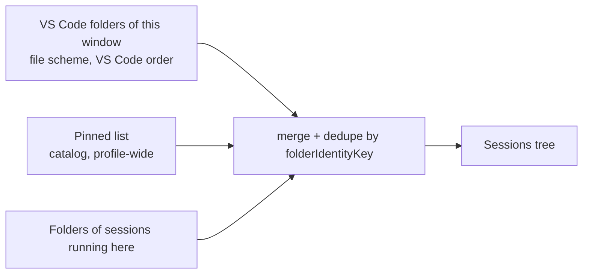

# Window folders, pinned folders and the "Open in another window" row state

## Problem

Two gaps in the Sessions view.

1. **Folders must be added by hand.** Sessions shows only the folders the user added to a profile-wide list. A user who opens a project in VS Code sees an empty view until they add that same project again, and a multi-root workspace needs one Add per root.
2. **A session held by another window reads as "Blocked".** A row whose claim is held by another live VS Code window of this extension shows the generic warning state, as if something were wrong, and the view learns of the other window only when it is refreshed (focus, visibility, an explicit refresh).

## Goals and Non-goals

- Goals:
  - Sessions shows the current window's VS Code folders (the single folder, or every `file` root of a multi-root workspace) automatically and live, next to the user's durable folders.
  - The durable list becomes the list of **pinned** folders. Folders already in it become pinned with no data migration. Add Folder pins.
  - One displayed list, deduplicated by path identity; stable folder ids across pinning; per-window collapsed state for unpinned folders; a setting to hide window folders; every folder consumer uses the merged list.
  - A session held by another live window shows a distinct row state, **Open in another window**, which never launches and updates by itself when the other window opens or stops the session; after that window is simply closed it is rechecked on focus, visibility change or click.
- Non-goals:
  - No change to claims, ownership rules or the Stop action's authority ([ADR-0039](../decisions/0039-refuse-only-on-a-verified-live-writer-the-extension-owns.md)).
  - Window folders are never persisted and never change VS Code workspace roots.
  - Remote and virtual workspace folders are not shown (the extension is Windows-only and UI-side).
  - No polling. A window that ends without releasing its claim leaves a record no event announces; the existing focus/visibility refresh re-verifies it.

## Current State

- `WorkspaceFolderRegistry` (`src/views/workspace-folders.ts`) stores `{id, path, collapsed}` records in the catalog key `omp.workspaceFolders.v1`, shared by every window of the profile (ADR-0034). Ids are random UUIDs minted on Add.
- `SessionTreeProvider` renders `registry.list()`. Folder-scoped commands (New Session, Resume, Open/Reconnect Terminal), the Add Selection / Add File picker and the Remove action read the registry directly. Remove's live-session guard exists in the registry but the command did not pass it.
- `launcherOwnershipFacts` reads the claim and reports `heldElsewhere`; `sessionItemState` maps that to `blocked` with a `.rival` context suffix. The Processes view's row fact `heldElsewhere` was taken from window-local facts that never carry it.
- `src/host/session-claim.ts` files one `<sha256>.claim` per identity under `<global storage>/session-claims`.

## Proposed Design

### Folder model

`LauncherFolders` (`src/views/launcher-folders.ts`, VS Code–free, all inputs injected) produces the list a window shows. A `LauncherFolder` is `{ id, path, collapsed, pinned, open }`.

Order: folders open in this window first, in VS Code's order (a pinned folder that is also open takes its place here); then the other pinned folders in stored order; then live-session-only folders in session order.

- **Deduplication** uses `folderIdentityKey`, the same identity folding Add already used, so `C:\Work`, `c:/work/` and an 8.3 alias are one folder. When a folder is both open and pinned the pinned record supplies id, path and collapsed state and the node carries the pin icon and `pinned` context.
- **Live sessions.** A folder that is neither open nor pinned stays while a session runs or is launching in this window, so a live row never disappears with its workspace folder. It is derived each time and persists nothing. Rows are filed by their recorded working directory, so a session whose directory is another spelling of a shown folder that string normalization cannot fold (a junction) gets its own heading with an alias id derived from that spelling; every id in the list is unique.
- **Setting.** `omp.showWorkspaceFolders` (default `true`). When `false` the open-folder source is skipped: only pinned folders remain, plus live-session folders so a running row still has its heading. A folder is still marked `open` when pinned.
- **Window changes** (`onDidChangeWorkspaceFolders`, setting change) refresh the view. The only disk access is resolving a path's identity (junctions, 8.3 names, drive aliases), done once per path and remembered; the memory is cleared when the open folders change, when the pinned list is reloaded and when it grows past a small bound.

### Stable ids

An unpinned folder's id is `windowFolderId(path)`: `folder:` plus 32 hex characters of the SHA-256 of the folder's identity key. Pin registers the folder under that very id, and every new pinned record (Add, Pin, a folder a new session was started in) uses it, so Pin does not change a node id, a command argument or a collapsed state. Identity folding makes every spelling and every window derive the same id, so two windows pinning the same folder write records with the same id and the keyed catalog merge keeps one. The merge reports no conflict when the two records are equal; if a concurrent pin differs in the stored spelling of the path (letter case, 8.3 name, junction) or in the collapsed flag, one conflict entry is recorded and the last writer's version wins, with no data lost. This is reachable only when the second window pins before it has adopted the first window's pin; otherwise registration finds the existing record by identity and creates nothing. Records pinned by an earlier build keep their random ids: they need no migration, they are matched to open folders by path, and only when such a folder is unpinned while open does its node take the derived id (the collapsed state is carried over).

### Pin, Unpin and Remove

Remove becomes **Unpin**. Both only ever dropped the durable entry; with window folders there is nothing else to remove, so a second action would only add a confusing choice. The folder menu offers exactly one of **Pin Folder** (unpinned, also inline) or **Unpin Folder** (pinned). Add Folder stays and pins.

- **Pin** copies the folder's collapsed state into the pinned record and drops the per-window copy. The pin is committed to the catalog, so it appears in every window through the existing sync and survives closing the folder.
- **Unpin** removes the record from the profile-wide list. In a window that still has the folder open, or runs a session in it, the folder stays visible, now unpinned, with its collapsed state moved to workspace state.
- **No guard.** Unpin is never refused by a running session: it only drops the pinned record, and a folder this window runs a managed OMP session in stays visible (unpinned) through the live-session branch of the folder list. Nothing else is touched (no editor closed, no session forgotten, no file deleted).
- A stale id (a folder that is neither open, pinned nor live any more) is reported and never falls back to another folder.

### Collapsed state

Pinned folders keep theirs in the catalog record. Unpinned folders keep theirs in this window's workspace state (`omp.windowFolderCollapsed.v1`, the set of collapsed ids), keyed by the derived id so it survives the folder closing and reopening in the same workspace.

### Consumers

All read the merged list through `LauncherFolders`: the tree provider, New Session, Resume Session, Open/Reconnect Terminal (`resolveFolderArgument`), the generic `folderArgument` resolution (now generic over the folder type), the Add Selection / Add File picker, whose "New session in …" row starts in a shown folder directly and only pins a folder the launcher does not show, the `omp.hasWorkspaceFolders` welcome context, and catalog adoption. The Processes view labels sessions by their recorded folder and has no folder list, so only its other-window fact changes (below).

### "Open in another window"

`sessionItemState` returns the new `otherWindow` state (label "Open in another window", `multiple-windows` icon) for a holder another window had when the row was last observed, in place of `blocked`. The rules are unchanged: the state comes from the same claim read, the row is not forgettable or deletable, and the menu offers Stop on the rival's recorded host as before (`ompSession.<held>.otherWindow.…`; the `.rival` suffix is dropped because the state itself names it).

- **Click and Open do not launch.** `openSession` checks a row displayed as `otherWindow`: it re-reads the claim, and if another live window still holds it, shows "This session is open in another VS Code window. Switch to that window to use it." and returns. If the other window released it meanwhile, the ordinary open path continues. This is a message shortcut, not the safety rule: every other launch path (the mode-specific Open, a folder's Resume, Add to Session) still passes through `openTab` and claim admission, which refuse a verified rival. Add to Session never offers an `otherWindow` row as a target.
- **Live updates.** `src/host/claim-watch.ts` watches the claims directory with `fs.watch` (non-recursive, `persistent: false`), keeps only `*.claim` names, and reports the distinct names changed during a 150 ms debounce window. A probe on the development machine showed that reading or statting a claim caused no watch event while each claim write caused two, so the watcher did not feed on the observations it triggers; other volumes (for example with last-access updates enabled) may behave differently, and the loop is bounded either way because an observation never writes a claim. The extension maps names to tab ids with `claimFileNameFor` over the index's current claim targets (resolved once per target, cleared when the catalog is adopted) and calls `SessionTreeProvider.refreshOwnership(tabIds)`, which marks only those rows' observations dirty and lets the existing bounded enrichment queue re-observe them. The last value stays on screen until the new one arrives, so rows do not flicker through Checking. A change the watcher cannot attribute (a nameless event) refreshes every row's ownership, exactly like focus. The watcher is created with the launcher, disposed with the extension, and spawns nothing itself; a watcher error is logged and the focus refresh remains the recovery.
- **Processes view.** For session rows that Sessions also shows, its "another window" label is taken from the same displayed state when the Processes view refreshes, so the two agree at that moment and the Processes label can lag a Sessions row by one refresh.

The row now retains a known run state followed by “in another window”, and offers Switch to Window in its context menu and opening notification. Claim records optionally carry the owning saved workspace URI or single-folder URI for navigation only; saved workspace files preserve multi-root identity, while unsaved multi-root and older claims remain manual Window-menu cases. Navigation rechecks the holder, uses `vscode.openFolder` with `forceNewWindow: false`, and never substitutes the session's working directory.

## Alternatives

- **Persist window folders as auto-pinned records.** Rejected: they would outlive the workspace and appear in every window, which is exactly the Pin action's meaning.
- **Random ids with a path lookup for window folders.** Rejected: ids would change at Pin, breaking row identity and folder-scoped arguments; deriving the id from identity needs no mapping store.
- **Keep Remove beside Unpin.** Rejected: both drop the same record; two names for one effect.
- **Poll claims.** Rejected: the claims directory is the one place a change is visible and the repository already watches the catalog the same way.
- **Refresh every row on any claim event.** Rejected: a foreign holder's liveness check reads the process creation time through PowerShell (existing behavior), so a burst of claim writes would otherwise pay it for every row.

## Risks and Open Questions

- Ownership observation of a foreign claim still runs the existing synchronous process-creation-time read, and the existing code reads it twice per observed row (the liveness check and the verified-writer check). A window restoring many sessions causes those reads per affected row in the watching window (bounded to rows whose claim changed, not cached, to keep the claim rules untouched).
- The state is an observation, not an authority, and closing a window is the normal way it goes stale. By design (ADR-0039, `deactivate`) a normal window close or reload does not release claims: the OMP children and their claims outlive the extension host, and the holder is verified dead only when someone reads the claim. A crash behaves the same. Nothing announces either, so the row keeps showing Open in another window until the watching window regains focus, its view becomes visible again, or the row is clicked (the click re-reads the claim and then opens normally). The live update is exact for the other window opening or stopping the session; after a simple close it is a recheck on focus or click. The tooltip says "when it was last checked" for that reason.
- `fs.watch` on a directory can drop events under load, and a watcher error ends live updates until the window reloads; the focus/visibility refresh remains the recovery.
- Unpinning a legacy-id folder that is still open changes its node id once.
- A window running the previous 0.1.0 build that pins a folder mints a random id. When another window of the new build pins the same folder concurrently, the catalog merge de-duplicates records naming one directory (`mergeWorkspaceFolderRecords`): committed owners go first and the loser is reported as a merge conflict ("another window registered … under a different id"). If the random-id record was committed first, the pinning window's node id changes once to the kept id and a stale argument naming the dropped id is reported as stale. Because 0.1.0 is unreleased this only affects development windows.
- Pin on an alias heading (a live-session folder whose recorded directory is a junction or substitute-drive spelling of a shown folder) pins that spelling: the record is stored under the target's derived id with the alias path, the open folder's heading then shows that spelling, and stopped rows whose recorded directory has the other spelling are matched by exact string and can appear under no folder. If the target is already pinned, Pin on the alias heading reports "already pinned" while the heading stays unpinned. This needs a junction or substitute drive and a session started through it, is the same class as the existing pinned-spelling-versus-recorded-directory behavior, and is not a safety issue.
- The id derives from the identity key. If the key's derivation ever changes, a pinned folder keeps its stored id (records are matched by path), and only unpinned or new folders take new ids.

## Rollout and Verification

Implemented in one change with unit tests for the merge (case and trailing-slash identity, a real junction, pin/unpin transitions, window changes, live-session folders, setting off, id stability, argument resolution), the state derivation and context values, the claim watcher against a real temporary claims directory, and a lifecycle test where a real claim file written into a watched claims directory drives the provider to `otherWindow` and back through the repaint event. Isolated-window evidence: a multi-root workspace showing both folders, a pinned and open folder shown once with the pin icon, Pin surviving closure of the folder, Unpin, and two windows on one profile where a session opened in one shows "Open in another window" in the other within seconds and returns to normal when released.

## Related Decisions

- [ADR-0045](../decisions/0045-derive-window-folders-per-window-and-pin-with-identity-ids.md)
- [ADR-0020](../decisions/0020-separate-folder-navigation-from-session-ownership.md), [ADR-0034](../decisions/0034-store-sessions-in-one-profile-catalog.md), [ADR-0039](../decisions/0039-refuse-only-on-a-verified-live-writer-the-extension-owns.md)

## Architecture Review

- Reviewer: architect
- Outcome: accepted after fixes
- Notes: The review found no blocking flaw in the model. Its findings were applied: live-session folders compare by identity and ids are unique (alias ids), identities are remembered per path with explicit invalidation, the narrow supersession of ADR-0020/0025/0034 and the narrow amendment to ADR-0039 are recorded in ADR-0045 with reciprocal notes, the live-session guard now covers launching sessions, the tooltip states that the state is a last observation, Add to Session ignores other-window rows, the claim-name lookup is cached, and the watcher probe results and failure modes are documented above. The user-specified behavior that click and Open on an other-window row only inform was kept and recorded as an ADR-0039 amendment.
- Confirming review: a second architect review of the revised design and ADR-0045 found no blocker and confirmed that the safety rules of ADR-0034 and ADR-0039 are intact. Its documentation findings were applied: the stale `otherWindow` state after a normal window close is stated plainly (a close does not release claims by design), the concurrent-pin conflict scope and the legacy-id merge report are described accurately, the two ownership reads per row are named, the alias-heading Pin edge case and the watch-probe scope are recorded, and ADR-0025 carries its reciprocal note. The confirming review passed after these fixes.
